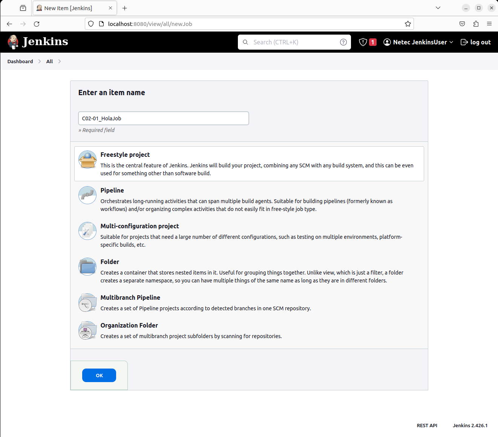
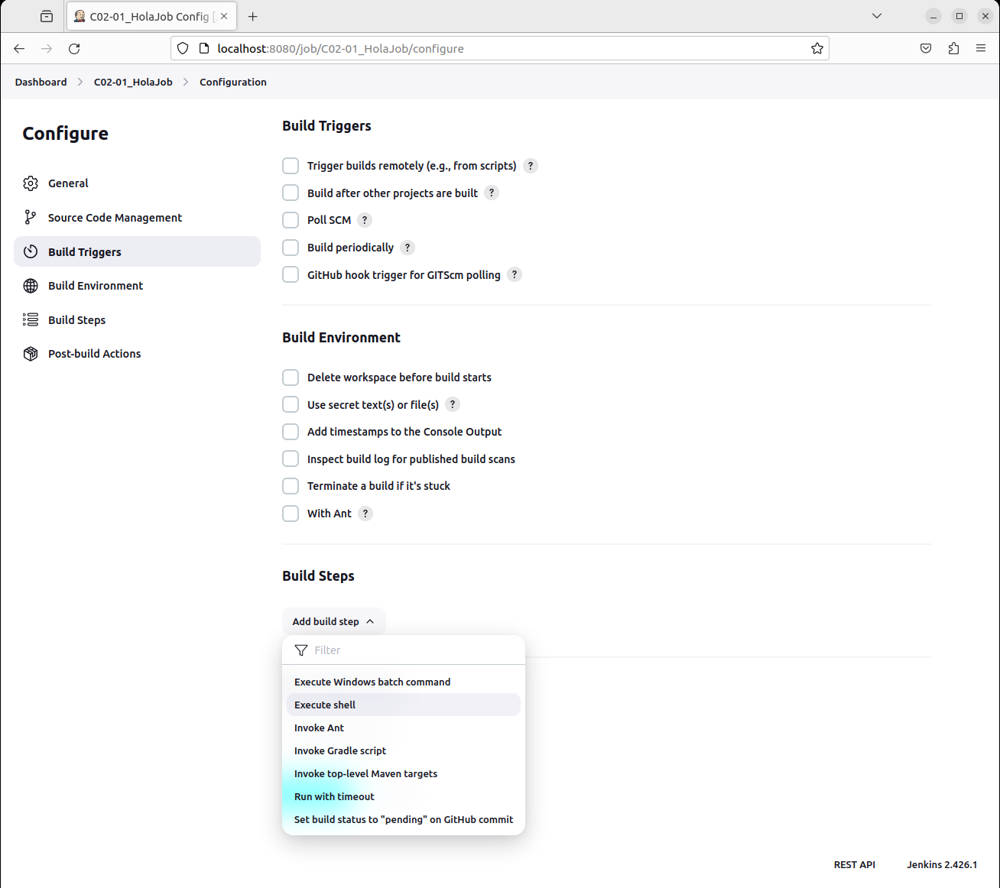
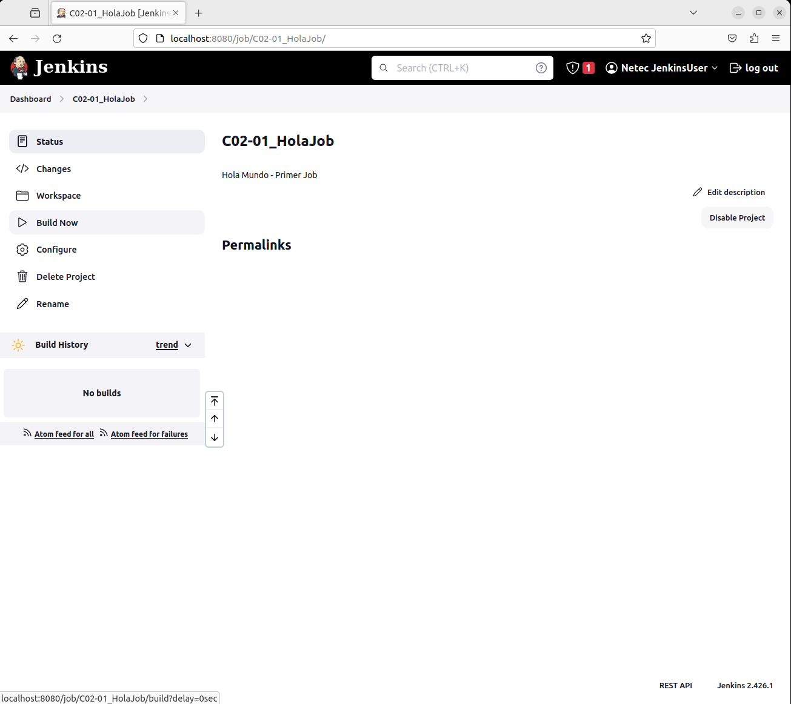
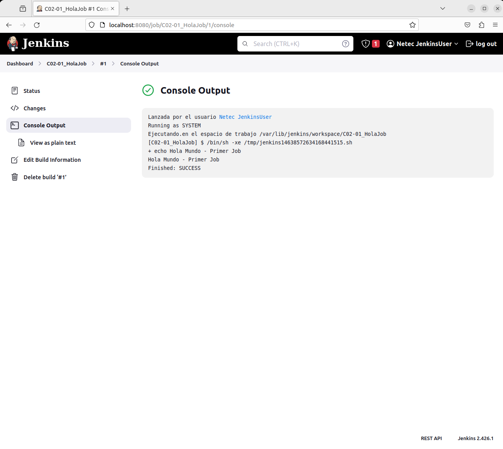

# HOLA JOB

Tiempo aproximado: 10 minutos

## OBJETIVO

Crear un proyecto *freestyle* en Jenkins.

## DESARROLLO

### CREACIÓN

En la pantalla principal (<http://localhost:8080/>) de Jenkins crea un nuevo proyecto dando clic en [+ New Item](http://localhost:8080/view/all/newJob) con los siguientes datos:

- Nombre: `C02-01_HolaJob`
- Tipo de proyecto: `Freestyle project`

Después de ingresar la información da clic en `OK`.

### CONFIGURACIÓN

A continuación, se indica la información a añadir en cada sección.

#### GENERAL

En la sección de `Configuration/General` ingresa la siguiente información:

- Descripción: `Hola Mundo - Primer Job`

#### BUILD STEPS

En la opción `Configuration/Build Steps/Add build step/Execute shell` ingresa la siguiente información:

- Comando: `echo "Hola Mundo - Primer Job"`

#### SAVE

Da clic en el botón de guardado ( `Save` )

### CONSTRUCCIÓN

Una manera para ejecutar el *job* es dando clic en la opción `Build Now` del menú lateral.

### SALIDA EN CONSOLA

En la parte inferior de la barra lateral izquierda, en la sección `Build History` se puede apreciar el historial de ejecución (*build*) del *job*.

Al dar clic en alguno de los enlaces (en cada renglón) se puede observar la información general del *build*.

Para observar la salida en consola de la construcción se debe seleccionar la opción `Console Output` del menú lateral.

### ADICIONAL

Repita la construcción en un par de ocasiones para observar que el histórico de ejecuciones se incrementa.

## RESULTADO

Comenta los puntos más relevantes de esta tarea.

---

[CAPÍTULO 02](../C02.md)
