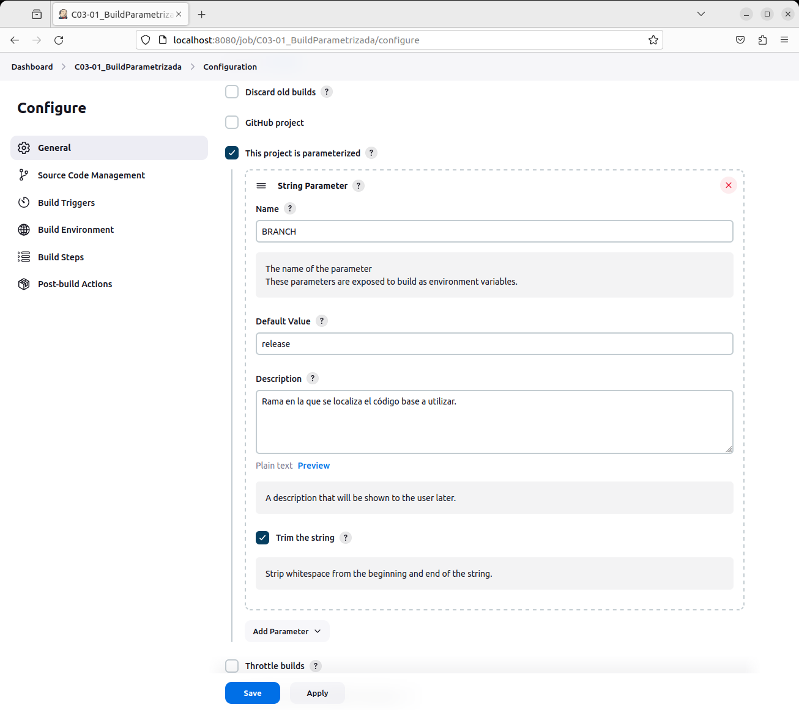
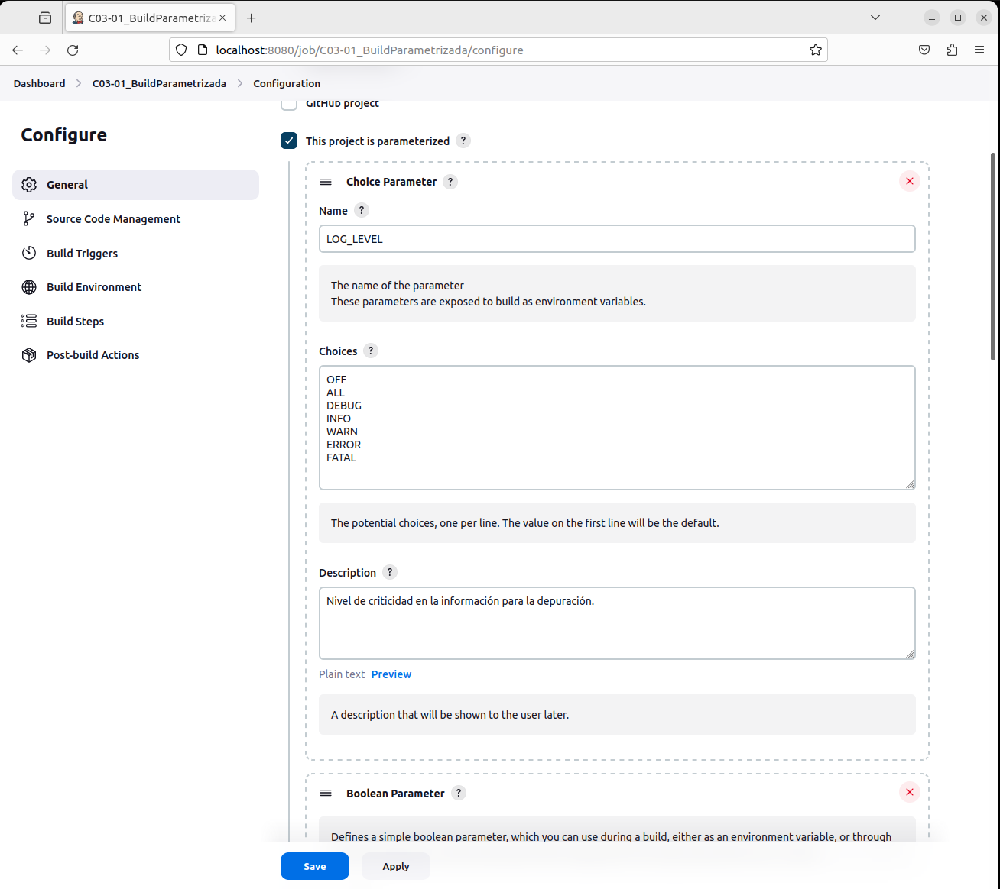
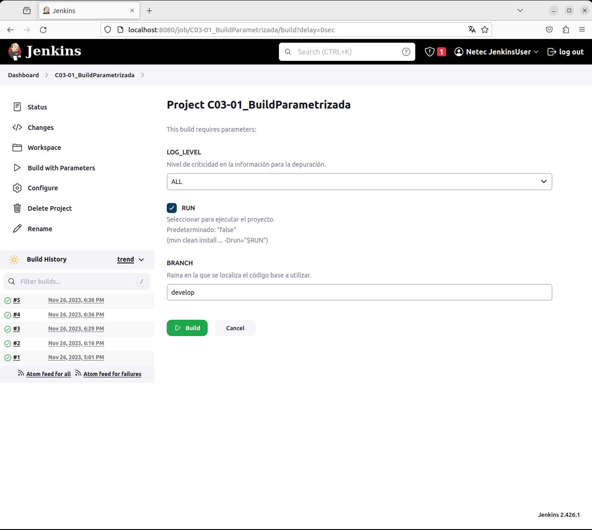

# BUILD PARAMETRIZADA

Tiempo aproximado: 20 minutos

## OBJETIVO

Crear y ejecutar un proyecto *freestyle* con parámetros.

## DESARROLLO

### CREACIÓN

En la pantalla principal (<http://localhost:8080/>) de Jenkins crea un nuevo proyecto dando clic en [+ New Item](http://localhost:8080/view/all/newJob) con los siguientes datos:

- Nombre: `C03-01_BuildParametrizada`
- Tipo de proyecto: `Freestyle project`

Después de ingresar la información da clic en `OK`.

### CONFIGURACIÓN

A continuación, se indica la información a añadir en cada sección.

#### GENERAL

En la sección de `Configuration/General` ingresa la siguiente información:

- Descripción: `Ejemplo de proyecto parametrizado.`
- This project is parameterized: \[SELECCIONADO\]


##### PARÁMETROS


En la sección de `Configuration/General/This project is parameterized/Add Parameter` ingresa los parámetros según la información indicada.

###### CADENA

Ingrese la información siguiente para un nuevo parámetro de tipo cadena.

- Name: `BRANCH`
- Default Value: `release`
- Description: `Rama en la que se localiza el código base a utilizar.`
- Trim the string: \[SELECCIONADO\]



###### BOOLEANO

Ingrese la información siguiente para un nuevo parámetro de tipo booleano.

- Name: `RUN`
- Description: `Seleccionar para ejecutar el proyecto. Predeterminado: "false" (mvn clean install …​ -Drun="$RUN")`


###### LISTA DE SELECCIÓN (CHOICE)

Ingrese la información siguiente para un nuevo parámetro de tipo lista de selección (choice).

- Name: `LOG_LEVEL`
- Choices:

``` shell
OFF
ALL
DEBUG
INFO
WARN
ERROR
FATAL
```

- Description: `Nivel de criticidad en la información para la depuración.`



#### BUILD TRIGGERS

Habilitar la opción de ejecutar remotamente.

- Trigger builds remotely (e.g., from scripts): \[SELECCIONADO\]
- Authentication Token: `jenkinsToken2BuildRemotely`


#### BUILD STEPS

En la opción `Configuration/Build Steps/Add build step/Execute shell` ingresa la siguiente información:

- Comando:

``` shell
echo "===== PARÁMETROS"
echo "BRANCH:" $BRANCH
echo "RUN:" $RUN
echo "LOG_LEVEL:" $LOG_LEVEL
```

#### SAVE

Da clic en el botón de guardado ( `Save` )

### CONSTRUCCIÓN

Una manera para ejecutar el *job* es dando clic en la opción `Build with Parameter` del menú lateral. En la ventana que aparece, adiciona la información de tu preferencia a los parámetros y da clic en `Build`.



### SALIDA EN CONSOLA

En la parte inferior de la barra lateral izquierda, en la sección `Build History` se puede apreciar el historial de ejecución (*build*) del *job*.

Al dar clic en alguno de los enlaces (en cada renglón) se puede observar la información general del *build*.

Para observar la salida en consola de la construcción se debe seleccionar la opción `Console Output` del menú lateral.

La salida debe ser semejante a:

``` shell
Lanzada por el usuario Netec JenkinsUser
Running as SYSTEM
Ejecutando.en el espacio de trabajo /var/lib/jenkins/workspace/C03-01_BuildParametrizada
[C03-01_BuildParametrizada] $ /bin/sh -xe /tmp/jenkins6606162388915164179.sh
+ echo ===== PARÁMETROS
===== PARÁMETROS
+ echo BRANCH: release
BRANCH: release
+ echo RUN: true
RUN: true
+ echo LOG_LEVEL: ALL
LOG_LEVEL: ALL
Finished: SUCCESS
```

### CONSTRUCCIÓN REMOTA

Antes de poder solicitar la ejecución remota del *job*, es requerido que el usuario tenga un API Token.

En la pantalla de configuración del usuario (<http://localhost:8080/user/netec/configure>):

- Da clic en la opción: `API Token / Add new Token`
- Ingrese el nombre de token: `apiToken`
- Da clic en `Generate`
- Haz una copia del código generado.
  - En este ejemplo es: `1166bdac19af30d84bd2ba0eaf4aeb53f1`


Haz clic en `Save` para guardar la configuración.

#### PETICIÓN POST

Para realizar una solicitud `POST` para invocar el *job* puede utilizar `cURL` de la manera siguiente:

``` shell
curl --user netec:1166bdac19af30d84bd2ba0eaf4aeb53f1 -X POST http://localhost:8080/job/C03-01_BuildParametrizada/buildWithParameters?token=jenkinsToken2BuildRemotely&BRANCH=develop&LOG_LEVEL=ALL&RUN=true
```

Donde el valor `1166bdac19af30d84bd2ba0eaf4aeb53f1` es el token recientemente generado.

Revisa el historial de ejecuciones y la salida en consola para validar que el *job* ha sido ejecutado de manera satisfactoria con los valores pasados como parámetros mediante una petición HTTP.

<div class="note">
De tener algún problema se recomienda la instalación y uso de un cliente web como `Postman` (`sudo snap install postman`). Recuerde pasar los datos de autenticación en modo básica.
</div>

### ADICIONAL

Repite la ejecución variando los valores de los parámetros y observa los resultados.

## RESULTADO

Comenta los puntos más relevantes de esta tarea.

---

[CAPÍTULO 03](../C03.md)
