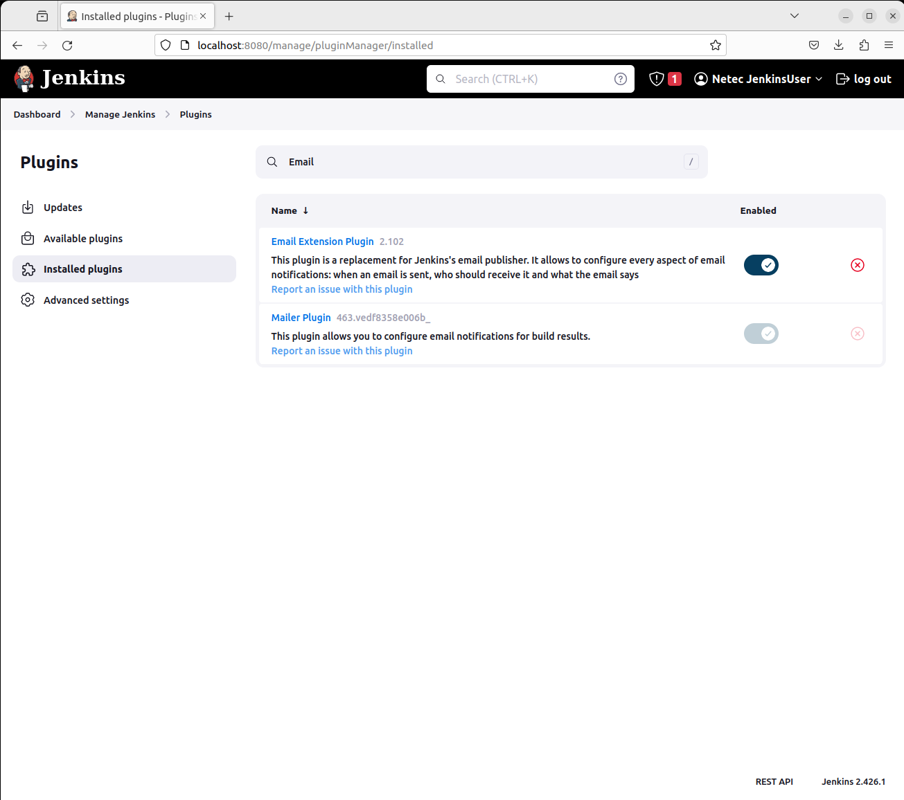
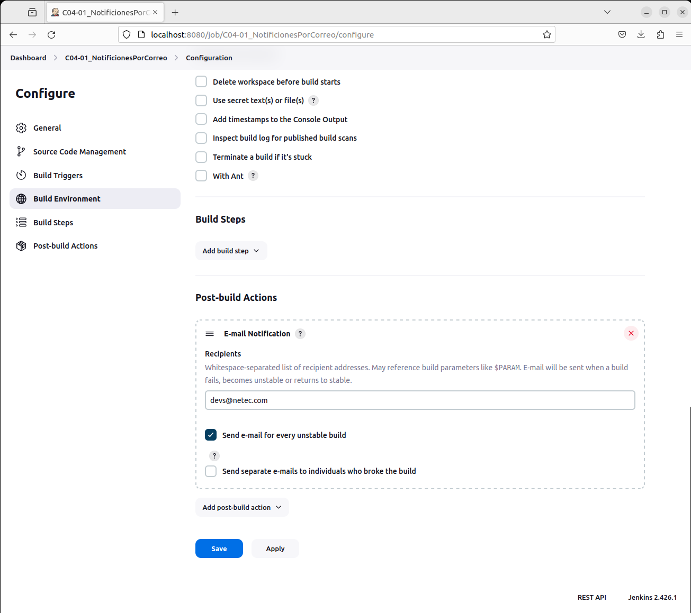
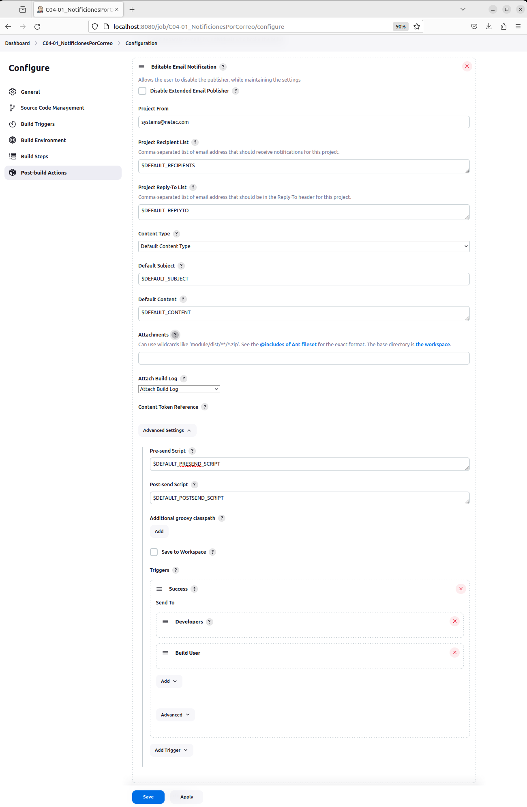
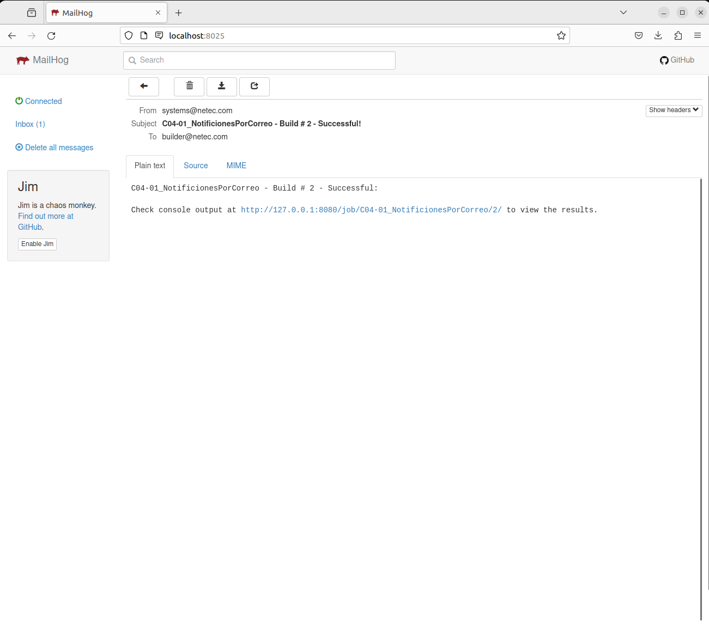
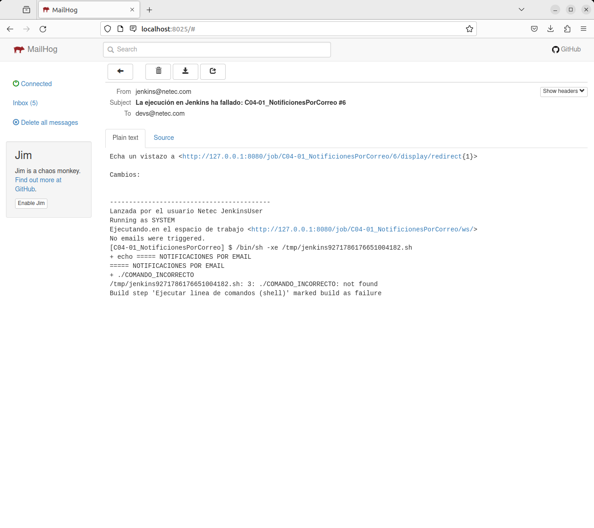

# NOTIFICACIONES POR CORREO

Tiempo aproximado: 20 minutos

## OBJETIVO

Crear y ejecutar un proyecto *freestyle* que envíe notificaciones vía correo electrónico.

## PRERREQUISITOS

### MAILHOG

Para el desarrollo de esta actividad se utilizará [MailHog](https://github.com/mailhog/MailHog/tree/master) como servidor de correo electrónico.

<div class="note">

Puede ser utilizado cualquier otro servidor de correo siempre que se tenga acceso a la información de autenticación y del servidor SMTP.

</div>

#### INSTALACIÓN

Primero se requiere la instalación de la plataforma para *Go*.

``` shell
sudo apt-get -y install golang-go
```

Con una salida semejante a:

``` shell
[sudo] password for netec:
Reading package lists... Done
Building dependency tree... Done
Reading state information... Done
golang-go is already the newest version (2:1.18~0ubuntu2).
0 upgraded, 0 newly installed, 0 to remove and 12 not upgraded.
5 not fully installed or removed.
After this operation, 0 B of additional disk space will be used.
Setting up pkg-config (0.29.2-1ubuntu3) ...
Setting up golang-1.18-src (1.18.1-1ubuntu1.1) ...
Setting up golang-src (2:1.18~0ubuntu2) ...
Setting up golang-1.18-go (1.18.1-1ubuntu1.1) ...
Setting up golang-go:amd64 (2:1.18~0ubuntu2) ...
Processing triggers for man-db (2.10.2-1) ...
```

A continuación, se instala *MailHog*:

``` shell
go install github.com/mailhog/MailHog@latest
#go get github.com/mailhog/MailHog
```

Con una salida semejante a:

``` shell
go: downloading github.com/mailhog/MailHog v1.0.1
go: finding module for package github.com/mailhog/MailHog-Server/config
go: finding module for package github.com/mailhog/MailHog-Server/api
go: finding module for package github.com/gorilla/pat
go: finding module for package github.com/ian-kent/go-log/log
go: downloading github.com/mailhog/MailHog-Server v1.0.1
go: finding module for package github.com/mailhog/MailHog-Server/smtp
go: finding module for package github.com/mailhog/MailHog-UI/assets
go: downloading github.com/ian-kent/go-log v0.0.0-20160113211217-5731446c36ab
go: downloading github.com/gorilla/pat v1.0.2
go: finding module for package github.com/mailhog/MailHog-UI/config
go: finding module for package github.com/mailhog/MailHog-UI/web
go: finding module for package github.com/mailhog/http
go: downloading github.com/mailhog/MailHog-UI v1.0.1
go: downloading github.com/mailhog/http v1.0.1
go: finding module for package github.com/mailhog/mhsendmail/cmd
go: finding module for package golang.org/x/crypto/bcrypt
go: finding module for package github.com/ian-kent/envconf
go: downloading golang.org/x/crypto v0.16.0
go: downloading github.com/mailhog/mhsendmail v0.2.0
go: downloading github.com/ian-kent/envconf v0.0.0-20141026121121-c19809918c02
go: found github.com/gorilla/pat in github.com/gorilla/pat v1.0.2
go: found github.com/ian-kent/go-log/log in github.com/ian-kent/go-log v0.0.0-20160113211217-5731446c36ab
go: found github.com/mailhog/MailHog-Server/api in github.com/mailhog/MailHog-Server v1.0.1
go: found github.com/mailhog/MailHog-Server/config in github.com/mailhog/MailHog-Server v1.0.1
go: found github.com/mailhog/MailHog-Server/smtp in github.com/mailhog/MailHog-Server v1.0.1
go: found github.com/mailhog/MailHog-UI/assets in github.com/mailhog/MailHog-UI v1.0.1
go: found github.com/mailhog/MailHog-UI/config in github.com/mailhog/MailHog-UI v1.0.1
go: found github.com/mailhog/MailHog-UI/web in github.com/mailhog/MailHog-UI v1.0.1
go: found github.com/mailhog/http in github.com/mailhog/http v1.0.1
go: found github.com/mailhog/mhsendmail/cmd in github.com/mailhog/mhsendmail v0.2.0
go: found golang.org/x/crypto/bcrypt in golang.org/x/crypto v0.16.0
go: found github.com/ian-kent/envconf in github.com/ian-kent/envconf v0.0.0-20141026121121-c19809918c02
go: downloading github.com/gorilla/context v1.1.2
go: downloading github.com/gorilla/mux v1.8.1
go: finding module for package github.com/ian-kent/linkio
go: finding module for package github.com/mailhog/storage
go: finding module for package github.com/mailhog/data
go: finding module for package github.com/ian-kent/goose
go: downloading github.com/ian-kent/linkio v0.0.0-20170807205755-97566b872887
go: downloading github.com/mailhog/storage v1.0.1
go: finding module for package github.com/mailhog/smtp
go: downloading github.com/ian-kent/goose v0.0.0-20141221090059-c3541ea826ad
go: finding module for package github.com/ogier/pflag
go: finding module for package github.com/gorilla/websocket
go: downloading github.com/mailhog/data v1.0.1
go: finding module for package github.com/t-k/fluent-logger-golang/fluent
go: downloading github.com/gorilla/websocket v1.5.1
go: downloading github.com/mailhog/smtp v1.0.1
go: downloading github.com/ogier/pflag v0.0.1
go: downloading github.com/t-k/fluent-logger-golang v1.0.0
go: found github.com/ian-kent/goose in github.com/ian-kent/goose v0.0.0-20141221090059-c3541ea826ad
go: found github.com/mailhog/data in github.com/mailhog/data v1.0.1
go: found github.com/mailhog/storage in github.com/mailhog/storage v1.0.1
go: found github.com/ian-kent/linkio in github.com/ian-kent/linkio v0.0.0-20170807205755-97566b872887
go: found github.com/mailhog/smtp in github.com/mailhog/smtp v1.0.1
go: found github.com/ogier/pflag in github.com/ogier/pflag v0.0.1
go: found github.com/gorilla/websocket in github.com/gorilla/websocket v1.5.1
go: found github.com/t-k/fluent-logger-golang/fluent in github.com/t-k/fluent-logger-golang v1.0.0
go: downloading golang.org/x/net v0.17.0
go: finding module for package github.com/tinylib/msgp/msgp
go: finding module for package gopkg.in/mgo.v2
go: finding module for package gopkg.in/mgo.v2/bson
go: downloading gopkg.in/mgo.v2 v2.0.0-20190816093944-a6b53ec6cb22
go: downloading github.com/tinylib/msgp v1.1.9
go: found gopkg.in/mgo.v2 in gopkg.in/mgo.v2 v2.0.0-20190816093944-a6b53ec6cb22
go: found gopkg.in/mgo.v2/bson in gopkg.in/mgo.v2 v2.0.0-20190816093944-a6b53ec6cb22
go: found github.com/tinylib/msgp/msgp in github.com/tinylib/msgp v1.1.9
go: downloading github.com/philhofer/fwd v1.1.2
```

#### INICIAR MAILHOG

Para iniciar *MailHog* se requiere que en una terminal (que se quedará utilizada por el proceso) se ejecute:

``` shell
~/go/bin/MailHog
```

La salida será semejante a:

``` shell
2023/11/27 13:47:36 Using in-memory storage
2023/11/27 13:47:36 [SMTP] Binding to address: 0.0.0.0:1025
[HTTP] Binding to address: 0.0.0.0:8025
2023/11/27 13:47:36 Serving under http://0.0.0.0:8025/
Creating API v1 with WebPath:
Creating API v2 with WebPath:
[APIv2] GET /api/v2/jim
[APIv2] GET /api/v2/messages
[APIv2] GET /api/v2/websocket
```

En la salida anterior se aprecia que la información del servidor es:

- Servidor SMTP: `localhost`
- Puerto SMTP: `1025`
- Interfaz de usuario: `http://localhost:8025`

#### DETENER MAILHOG

Al terminar la actividad, se recomienda cerrar la ventana en la que se encuentre corriendo o en ésta ejecutar <span class="keycombo">Control+C</span> para terminar la ejecución de *MailHog*.

## DESARROLLO

### COMPLEMENTOS PARA EMAIL

Para validar que los complementos que realizan las notificaciones por correo electrónico se encuentran instalados visita: <http://localhost:8080/manage/pluginManager/installed> y busca `Email`.

Deben aparecer habilitados los siguientes complementos:

1. Mailer Plugin
2. Email Extension Plugin



### CONFIGURACIÓN GENERAL

Par que Jenkins tenga la capacidad de enviar correos electrónicos se requiere configurar la información del servidor de correos en la configuración general en <http://localhost:8080/manage/configure>.

#### Dashboard / Manage Jenkins / System

- Jenkins Location
  - System Admin e-mail address: `jenkins@netec.com`


- E-mail Notification
  - SMTP Server: `localhost`
  - Advanced
    - SMTP Port: `1025`
    - Reply-To Address: `jenkins@netec.com`
    - Test configuration by sending test e-mail: [SELECCIONADO]
      - Test e-mail recipient: `test@netec.com`


Dar clic en el botón `Test configuration` para validar que un correo fue enviado exitosamente.

<div class="note">

En la interfaz web de *MailHog* <http://localhost:8025> se debe haber recibido el mensaje de prueba.

</div>

- Extended E-mail Notification
  - SMTP Server: `localhost`
  - SMTP Port: `1025`


### CREACIÓN DEL PROYECTO

En la pantalla principal (<http://localhost:8080/>) de Jenkins crea un nuevo proyecto dando clic en [+ New Item](http://localhost:8080/view/all/newJob) con los siguientes datos:

- Nombre: `C04-01_NotificacionesPorCorreo`
- Tipo de proyecto: `Freestyle project`

Después de ingresar la información da clic en `OK`.

### CONFIGURACIÓN

A continuación, se indica la información a añadir en cada sección.

#### GENERAL

En la sección de `Configuration/General` ingresa la siguiente información:

- Descripción: `Prueba de concepto de proyecto con notificaciones por correo electrónico.`
- This project is parameterized: [SELECCIONADO]

##### PARÁMETRO LISTA DE SELECCIÓN (CHOICE)

Ingrese la información siguiente para un nuevo parámetro de tipo lista de selección (choice).

- Name: `COMANDO`
- Choices:

``` shell
date
./COMANDO_INCORRECTO
```

- Description: `Comando 'date' para imprimir la información de fecha y 'COMANDO_INCORRECTO' para provocar un fallo en la ejecución.`

#### BUILD STEPS

En la opción `Configuration/Build Steps/Add build step/Execute shell` ingresa la siguiente información:

- Comando:

``` shell
echo "===== NOTIFICACIONES POR EMAIL"
$COMANDO
```

#### POST-BUILD ACTIONS

En la sección de acciones posteriores a la construcción adicionar la acción: `E-mail Notification` con la siguiente información:

- Add post-build action / E-mail Notification
  - Recipients: `devs@netec.com`
  - Send e-mail for every unstable build: [SELECCIONADO]



- Add post-build action / Editable Email Notification
  - Project From: `systems@netec.com`
  - Advanced Settings
    - Triggers
      - Failure - Any: [ELIMINAR]
        - Add Trigger: `Success`
          - Send To:
            - Add: `Build user`



#### SAVE

Da clic en el botón de guardado ( `Save` )

### CONSTRUCCIÓN

Para comprobar el envío de las notificaciones al correo electrónico ejecuta el *job* dando clic en la opción `Build with Parameter` del menú lateral.

#### EXITOSO

Para ejecutar de manera exitosa el *job* valida que la opción seleccionada en los parámetros de entrada es `date`.

A continuación, da clic en el botón `Build` y verifica que se ha recibido un correo electrónico de la construcción exitosa.



##### SALIDA EN CONSOLA

En la parte inferior de la barra lateral izquierda, en la sección `Build History` se puede apreciar el historial de ejecución (*build*) del *job*.

Al dar clic en alguno de los enlaces (en cada renglón) se puede observar la información general del *build*.

Para observar la salida en consola de la construcción se debe seleccionar la opción `Console Output` del menú lateral.

La salida debe ser semejante a:

``` shell
Lanzada por el usuario Netec JenkinsUser
Running as SYSTEM
Ejecutando.en el espacio de trabajo /var/lib/jenkins/workspace/C04-01_NotificionesPorCorreo
No emails were triggered.
[C04-01_NotificionesPorCorreo] $ /bin/sh -xe /tmp/jenkins8875660293737983629.sh
+ echo ===== NOTIFICACIONES POR EMAIL
===== NOTIFICACIONES POR EMAIL
+ date
mar 28 nov 2023 22:57:51 CST
Email was triggered for: Success
Sending email for trigger: Success
Sending email to: builder@netec.com
Finished: SUCCESS
```

#### FALLO

Para ejecutar de manera exitosa el *job* valida que la opción seleccionada en los parámetros de entrada es `COMANDO_INCORRECTO`.

A continuación, da clic en el botón `Build` y verifica que se ha recibido un correo electrónico de la construcción no exitosa.



##### SALIDA EN CONSOLA

En la parte inferior de la barra lateral izquierda, en la sección `Build History` se puede apreciar el historial de ejecución (*build*) del *job*.

Al dar clic en alguno de los enlaces (en cada renglón) se puede observar la información general del *build*.

Para observar la salida en consola de la construcción se debe seleccionar la opción `Console Output` del menú lateral.

La salida debe ser semejante a:

``` shell
Lanzada por el usuario Netec JenkinsUser
Running as SYSTEM
Ejecutando.en el espacio de trabajo /var/lib/jenkins/workspace/C04-01_NotificionesPorCorreo
No emails were triggered.
[C04-01_NotificionesPorCorreo] $ /bin/sh -xe /tmp/jenkins9271786176651004182.sh
+ echo ===== NOTIFICACIONES POR EMAIL
===== NOTIFICACIONES POR EMAIL
+ ./COMANDO_INCORRECTO
/tmp/jenkins9271786176651004182.sh: 3: ./COMANDO_INCORRECTO: not found
Build step 'Ejecutar linea de comandos (shell)' marked build as failure
Sending e-mails to: devs@netec.com
No emails were triggered.
Finished: FAILURE
```

## RESULTADO

Comenta los puntos más relevantes de esta tarea.

---

[CAPÍTULO 04](../C04.md)
