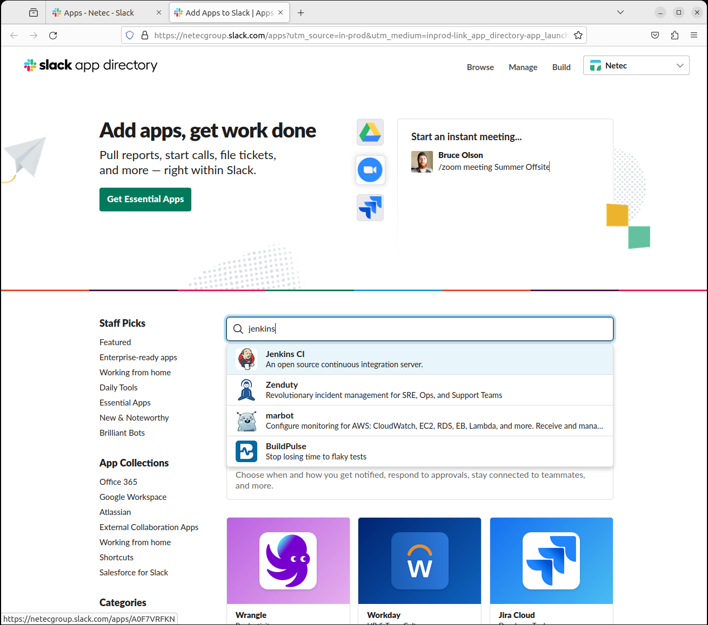
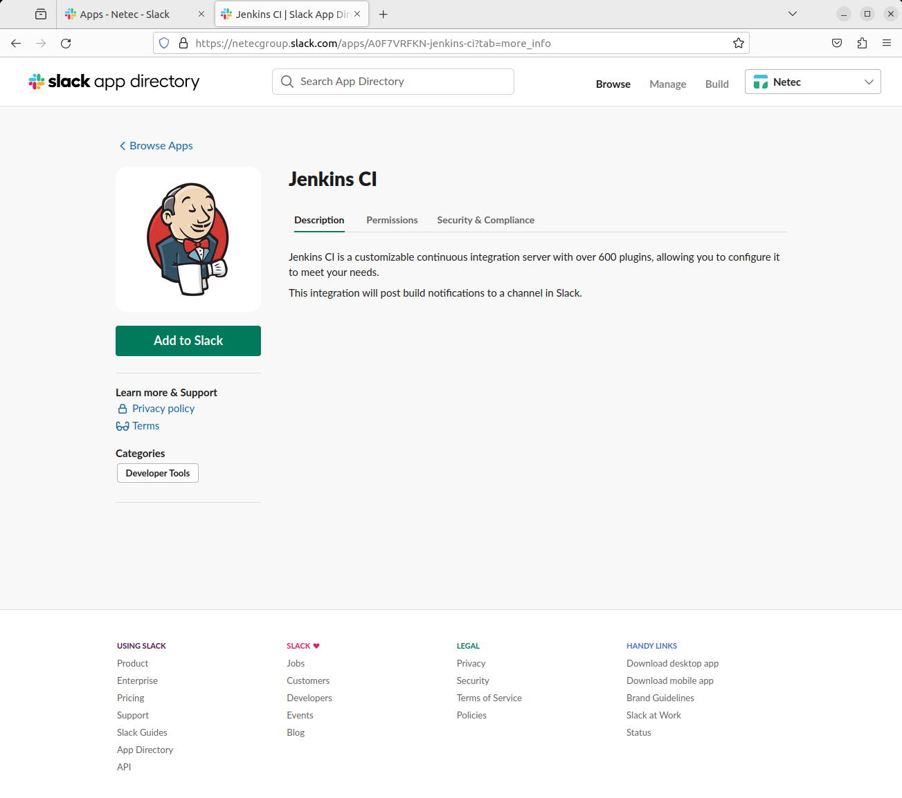
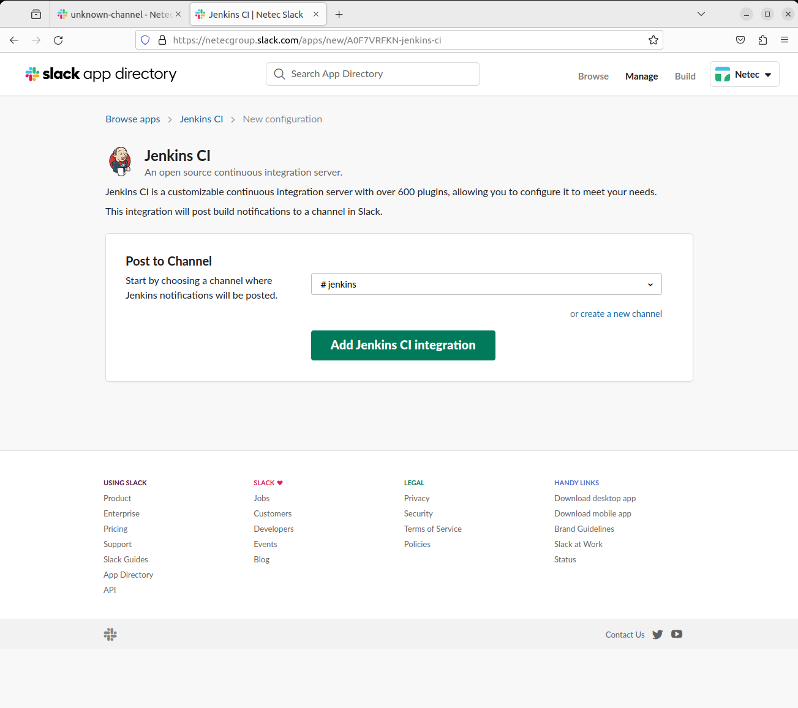
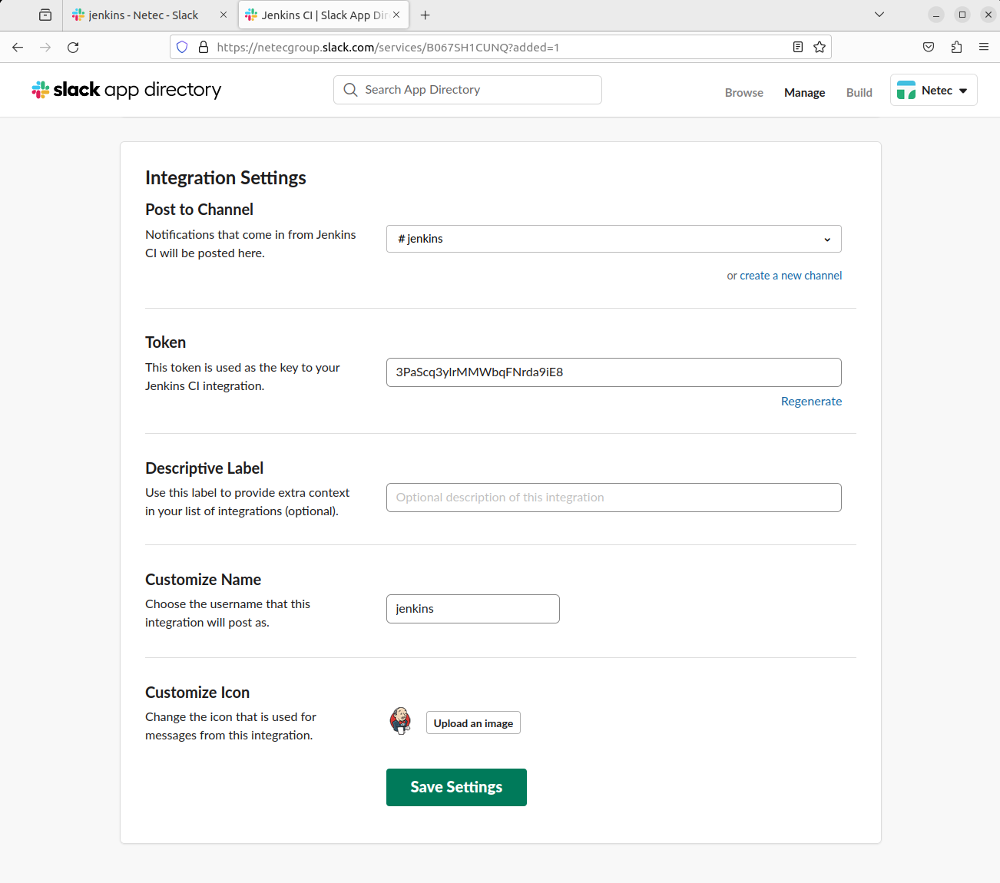
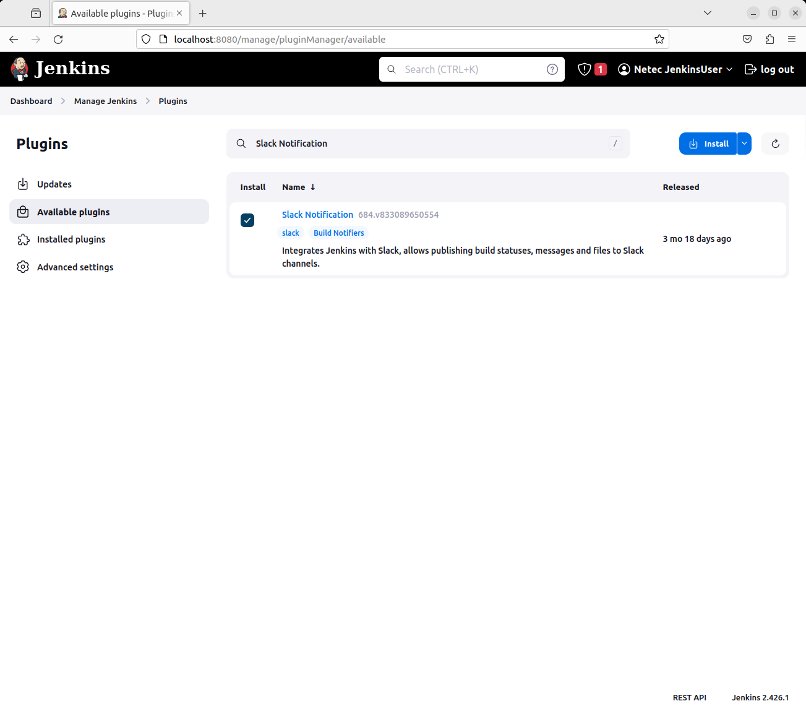
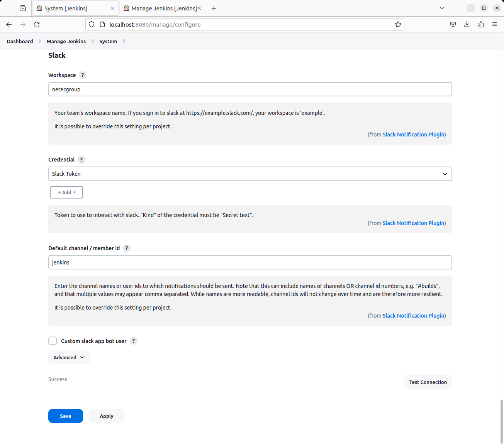
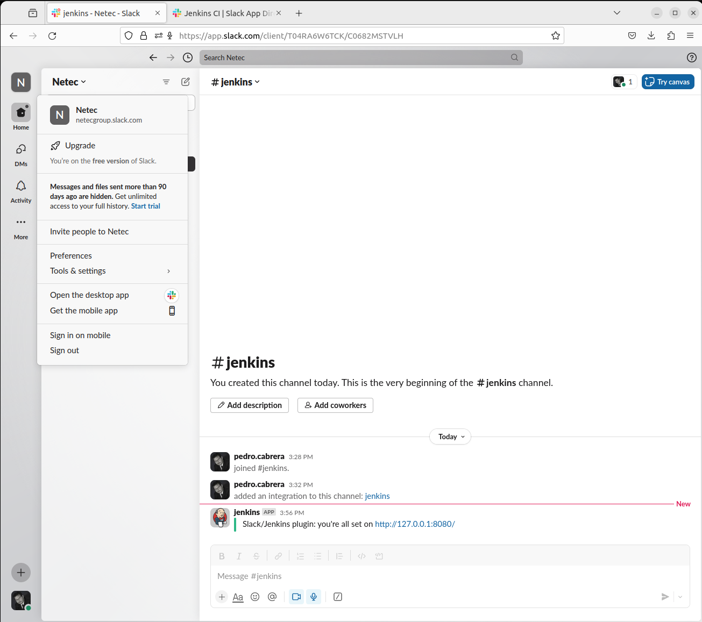
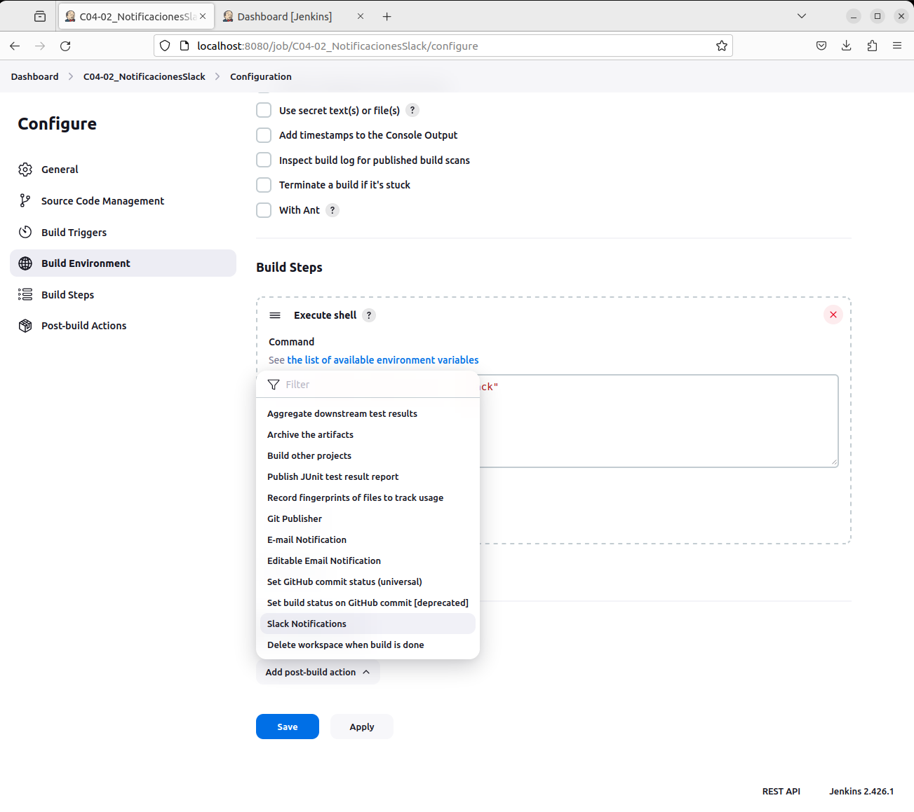
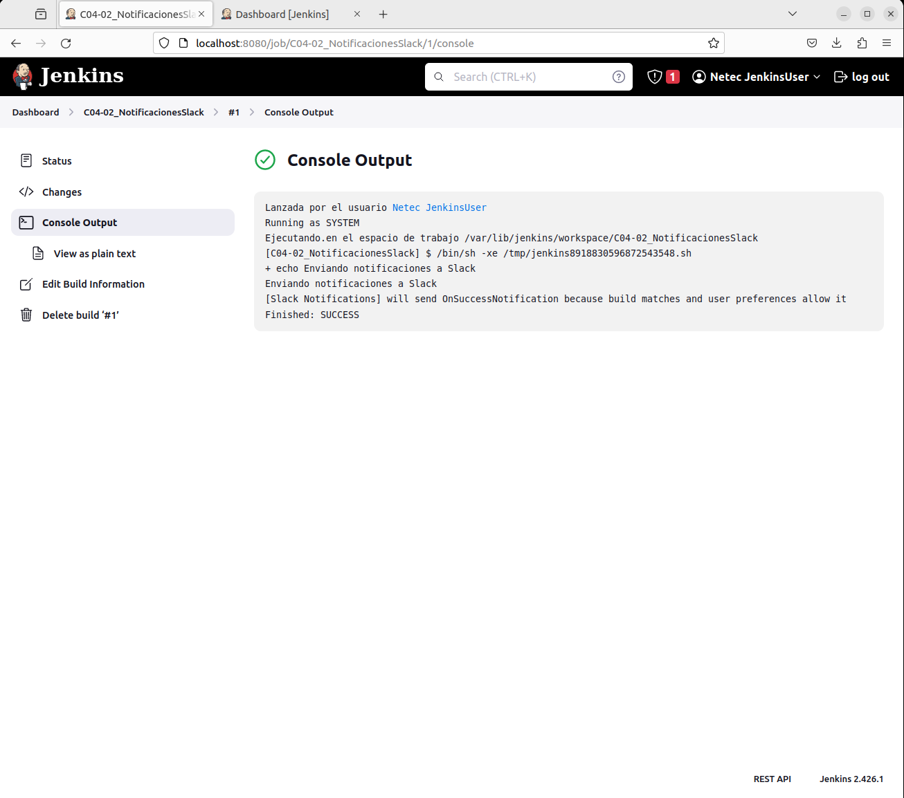

# NOTIFICACIONES POR SLACK

Tiempo aproximado: 20 minutos

## OBJETIVO

Crear y ejecutar un proyecto *freestyle* que envíe notificaciones vía mensajes instantáneos en *Slack*.

### PRERREQUISITOS

#### SLACK

Para esta actividad se requiere una cuenta de usuario en <https://slack.com/>.

<div class="note">

De no tener una cuenta de acceso, cree una gratuita con su información personal. En caso de no poder hacerlo atienda la demostración que el instructor hará de esta actividad.

</div>

## DESARROLLO

### JENKINS CI EN SLACK

La plataforma de mensajería *Slack* permite integrarse a otras plataformas mediante el mecanismo de *apps*. Para recibir notificaciones desde *Jenkins* se requiere adicionar *Jenkins CI* en la sección "directorio de aplicaciones".

Para acceder a esta se da clic en `Add apps` en la pantalla de inicio.



El proceso varia dependiendo las actualizaciones de la plataforma, pero es sencillo de seguir. A continuación, se muestran algunas pantallas con los pasos típicos de este proceso.








**Toma nota del token mostrado en la instalación, ya que será utilizado por *Jenkins* para la autenticación.**

### COMPLEMENTO PARA SLACK

Para la comunicación de *Jenkins* a *Slack* se requiere instalar (<http://127.0.0.1:8080/manage/pluginManager/available>) el siguiente complemento:

- Slack Notification



<div class="note">

Recuerde que, al instalar complementos típicamente se requiere el reinicio de Jenkins.

</div>

### CONFIGURACIÓN GENERAL

Par que *Jenkins* tenga la capacidad de enviar notificaciones a Slack se requiere configurar la información de la plataforma de mensajes en la configuración general en <http://localhost:8080/manage/configure>.

#### Dashboard / Manage Jenkins / System

- Slack
  - Workspace: `netecgroup`
  - Credential
    - Add
      - Kind: `Secret text`
        - Secret: `TOKEN_DE_SLACK`
        - ID: `slackToken`
        - Description: `Slack Token`
  - Default channel / member id: `jenkins`




Dar clic en el botón `Test Connection` para validar que *Jenkins* y *Slack* pueden comunicarse.

Para observar el mensaje se debe visitar *Slack* en el canal jenkins.



### CREACIÓN

En la pantalla principal (<http://localhost:8080/>) de Jenkins crea un nuevo proyecto dando clic en [+ New Item](http://localhost:8080/view/all/newJob) con los siguientes datos:

- Nombre: `C04-01_NotificacionesPorSlack`
- Tipo de proyecto: `Freestyle project`

Después de ingresar la información da clic en `OK`.

### CONFIGURACIÓN

A continuación, se indica la información a añadir en cada sección.

#### GENERAL

En la sección de `Configuration/General` ingresa la siguiente información:

- Descripción: `Prueba de concepto de proyecto con notificaciones por mensajes instantáneos a Slack.`
- This project is parameterized: [SELECCIONADO]

##### PARÁMETRO LISTA DE SELECCIÓN (CHOICE)

Ingrese la información siguiente para un nuevo parámetro de tipo lista de selección (choice).

- Name: `COMANDO`
- Choices:

``` shell
date
./COMANDO_INCORRECTO
```

- Description: `Comando 'date' para imprimir la información de fecha y 'COMANDO_INCORRECTO' para provocar un fallo en la ejecución.`

#### BUILD STEPS

En la opción `Configuration/Build Steps/Add build step/Execute shell` ingresa la siguiente información:

- Comando:

``` shell
echo "===== NOTIFICACIONES POR SLACK"
$COMANDO
```

#### POST-BUILD ACTIONS



En la sección de acciones posteriores a la construcción adicionar la acción `Slack Notifications` con la siguiente información:

- Add post-build action / Slack Notifications
  - Notify Build Start: [SELECCIONADO]
  - Notify Success: [SELECCIONADO]
  - Notify Aborted: [SELECCIONADO]
  - Notify Not Built: [SELECCIONADO]
  - Notify Unstable: [SELECCIONADO]
  - Notify Regression: [SELECCIONADO]
  - Notify Every Failure: [SELECCIONADO]
  - Notify Back To Normal: [SELECCIONADO]


#### SAVE

Da clic en el botón de guardado ( `Save` )

### CONSTRUCCIÓN

Para comprobar el envío de las notificaciones ejecuta el *job* dando clic en la opción `Build with Parameter` del menú lateral.

#### EXITOSO

Para ejecutar de manera exitosa el *job* valida que la opción seleccionada en los parámetros de entrada es `date`.

A continuación, da clic en el botón `Build` y verifica que se ha recibido una notificación de la construcción exitosa.




##### SALIDA EN CONSOLA

En la parte inferior de la barra lateral izquierda, en la sección `Build History` se puede apreciar el historial de ejecución (*build*) del *job*.

Al dar clic en alguno de los enlaces (en cada renglón) se puede observar la información general del *build*.

Para observar la salida en consola de la construcción se debe seleccionar la opción `Console Output` del menú lateral.

La salida debe ser semejante a:

``` shell
Lanzada por el usuario Netec JenkinsUser
Running as SYSTEM
Ejecutando.en el espacio de trabajo /var/lib/jenkins/workspace/C04-02_NotificacionesSlack
[C04-02_NotificacionesSlack] $ /bin/sh -xe /tmp/jenkins12647927718761723365.sh
+ echo ===== NOTIFICACIONES POR SLACK
===== NOTIFICACIONES POR SLACK
+ date
mié 29 nov 2023 12:26:52 CST
[Slack Notifications] found #1 as previous completed, non-aborted build
[Slack Notifications] will send OnSuccessNotification because build matches and user preferences allow it
Finished: SUCCESS
```

#### FALLO

Para ejecutar de manera exitosa el *job* valida que la opción seleccionada en los parámetros de entrada es `COMANDO_INCORRECTO`.

A continuación, da clic en el botón `Build` y verifica que se ha recibido una notificación de la construcción no exitosa.


##### SALIDA EN CONSOLA

En la parte inferior de la barra lateral izquierda, en la sección `Build History` se puede apreciar el historial de ejecución (*build*) del *job*.

Al dar clic en alguno de los enlaces (en cada renglón) se puede observar la información general del *build*.

Para observar la salida en consola de la construcción se debe seleccionar la opción `Console Output` del menú lateral.

La salida debe ser semejante a:

``` shell
Lanzada por el usuario Netec JenkinsUser
Running as SYSTEM
Ejecutando.en el espacio de trabajo /var/lib/jenkins/workspace/C04-02_NotificacionesSlack
[C04-02_NotificacionesSlack] $ /bin/sh -xe /tmp/jenkins17063772509875515960.sh
+ echo ===== NOTIFICACIONES POR SLACK
===== NOTIFICACIONES POR SLACK
+ ./COMANDO_INCORRECTO
/tmp/jenkins17063772509875515960.sh: 3: ./COMANDO_INCORRECTO: not found
Build step 'Ejecutar linea de comandos (shell)' marked build as failure
[Slack Notifications] found #2 as previous completed, non-aborted build
[Slack Notifications] will send OnEveryFailureNotification because build matches and user preferences allow it
Finished: FAILURE
```

## RESULTADO

Comenta los puntos más relevantes de esta tarea.

---

[CAPÍTULO 04](../C04.md)
