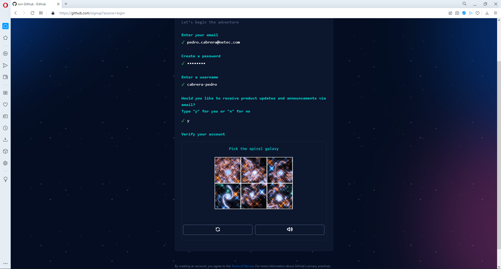

# GITHUB: CREACIÓN DE CUENTA

Tiempo aproximado: 10 minutos

## OBJETIVO

Crear una cuenta en *GitHub*.

## DESARROLLO

### CREACIÓN DE UNA CUENTA EN GITHUB

En esta actividad se crea una cuenta en el sitio GitHub.

Esta guía es una recomendación general, se recomienda dar seguimiento lo indicado en el sitio oficial.

Para crear una cuenta en GitHub, visite con su navegador el siguiente enlace: <https://github.com/signup>

La interfaz web de GitHub le pedirá gradualmente la siguiente información:

- Correo Electrónico: *ESCRIBA SU CORREO ELECTRÓNICO*
- Contraseña: *ESCRIBA_UNA_CONTRASEÑA*
- Cumpla las reglas indicadas
- Nombre de Usuario: *ESCRIBA_UN_NOMBRE_DE_USUARIO*
- Debe ser único
- Continuar: ingrese `yes` y de clic en el botón `Continue`
- Cumpla la actividad de verificación de cuenta
- Escriba el código enviado a su correo: *12345678* (ocho dígitos)

A continuación, se muestra una serie de imágenes que muestran un ejemplo de creación de una cuenta en GitHub.

## RESULTADO

Comenta los puntos más relevantes de esta tarea.

---

[CAPÍTULO 05](../C05.md)
