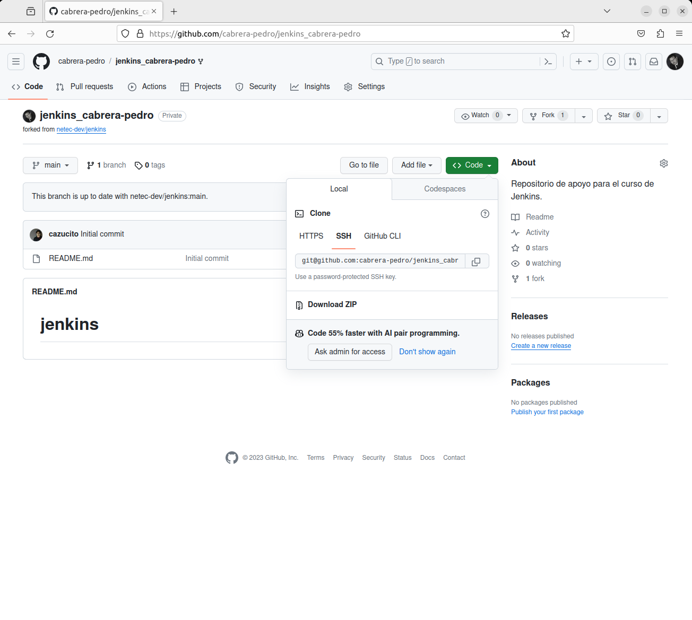

# LCM MANUAL

Tiempo aproximado: 15 minutos

## OBJETIVO

Construir, probar y ejecutar un proyecto *Maven* obtenido desde un repositorio bifurcado en GitHub.

## PRERREQUISITOS

En esta actividad se inicia a trabajar con *Maven* por lo que se requiere que esté instalado.

De no encontrarse, instalar con: `sudo apt install maven`.

## DESARROLLO

### BIFURCACIÓN

Realiza una bifurcación del repositorio localizado en GitHub <https://github.com/netec-dev/jenkins>.

Haga clic en el botón *Fork* ubicado en la zona de la esquina superior derecha como se muestra a continuación:


En la ventana, después de llenar con la información que se muestra, da clic en `Create Fork`:

- Repository name: jenkins_cabrera-pedro
  - Donde el nombre se construye con la cadena "jenkins" y "\_NOMBRE-DE-USUARIO"
- Copy the main branch only: \[SIN SELECCIONAR\]


### CLONADO

Para tener una copia local de trabajo, clona el repositorio recién creado por la bifurcación. La dirección de clonado puede localizarse en el botón `Code` de la pantalla inicial del repositorio.



Tu dirección debe ser similar a: <git@github.com>:cabrera-pedro/jenkins_cabrera-pedro.git\[<git@github.com>:cabrera-pedro/jenkins_cabrera-pedro.git\]

En una terminal de comandos ubicada en la ruta /home/netec/Desktop/curso ejecuta el siguiente comando para crear la copia local del repositorio de trabajo.

``` shell
git clone git@github.com:cabrera-pedro/jenkins_cabrera-pedro.git
```

<div class="note">
Recuerda sustituir la dirección de tu repositorio.
</div>

La salida debe ser similar a:

``` shell
Cloning into 'jenkins_cabrera-pedro'...
remote: Enumerating objects: 3, done.
remote: Counting objects: 100% (3/3), done.
remote: Total 3 (delta 0), reused 0 (delta 0), pack-reused 0
Receiving objects: 100% (3/3), done.
```

### RAMA DE TRABAJO

En la carpeta del repositorio recién clonado ubícate en la rama de trabajo: `labs/mvn-standalone`.

``` shell
git switch labs/mvn-standalone
```

La salida debe ser similar a:

``` shell
Switched to branch 'labs/mvn-standalone'
Your branch is up to date with 'origin/labs/mvn-standalone'.
```

### ANÁLISIS

Ya en la rama del proyecto Java, analiza el contenido del directorio. Para esto puedes abrir el proyecto en algún IDE de desarrollo como STS, VSCode, etcétera.

#### EJECUCIÓN DE PRUEBAS

Para ejecutar las pruebas unitarias (estando ubicado en la carpeta principal del proyecto), necesitas ejecutar el comando siguiente:

``` shell
mvn test
```

La salida debe ser similar a:

``` shell
[INFO] Scanning for projects...
[INFO]
[INFO] ---------------------< com.netec.pocs:hello-world >---------------------
[INFO] Building hello-world 0.1.0-SNAPSHOT
[INFO] --------------------------------[ jar ]---------------------------------
[INFO]
[INFO] --- maven-resources-plugin:2.6:resources (default-resources) @ hello-world ---
[INFO] Using 'UTF-8' encoding to copy filtered resources.
[INFO] skip non existing resourceDirectory /home/netec/Desktop/curso/jenkins/src/main/resources
[INFO]
[INFO] --- maven-compiler-plugin:3.8.1:compile (default-compile) @ hello-world ---
[INFO] Nothing to compile - all classes are up to date
[INFO]
[INFO] --- maven-resources-plugin:2.6:testResources (default-testResources) @ hello-world ---
[INFO] Using 'UTF-8' encoding to copy filtered resources.
[INFO] skip non existing resourceDirectory /home/netec/Desktop/curso/jenkins/src/test/resources
[INFO]
[INFO] --- maven-compiler-plugin:3.8.1:testCompile (default-testCompile) @ hello-world ---
[INFO] Nothing to compile - all classes are up to date
[INFO]
[INFO] --- maven-surefire-plugin:2.22.2:test (default-test) @ hello-world ---
[INFO]
[INFO] -------------------------------------------------------
[INFO]  T E S T S
[INFO] -------------------------------------------------------
[INFO] Running com.netec.pocs.standalone.BusinessTest
[INFO] Tests run: 3, Failures: 0, Errors: 0, Skipped: 0, Time elapsed: 0.039 s - in com.netec.pocs.standalone.BusinessTest
[INFO] Running com.netec.pocs.standalone.HelloWorldTest
[INFO] Tests run: 2, Failures: 0, Errors: 0, Skipped: 0, Time elapsed: 0.002 s - in com.netec.pocs.standalone.HelloWorldTest
[INFO]
[INFO] Results:
[INFO]
[INFO] Tests run: 5, Failures: 0, Errors: 0, Skipped: 0
[INFO]
[INFO] ------------------------------------------------------------------------
[INFO] BUILD SUCCESS
[INFO] ------------------------------------------------------------------------
[INFO] Total time:  2.571 s
[INFO] Finished at: 2023-12-01T14:37:57-06:00
[INFO] ------------------------------------------------------------------------
```

<div class="note">
Es posible que se descarguen algunas dependencias.
</div>

Como se observa en la salida, se han ejecutado de manera exitosa las pruebas unitarias.

#### CONSTRUCCIÓN

Para generar el artefacto *jar* de la aplicación utiliza el siguiente comando:

``` shell
mvn clean install
```

La salida debe ser similar a:

``` shell
[INFO] Scanning for projects...
[INFO]
[INFO] ---------------------< com.netec.pocs:hello-world >---------------------
[INFO] Building hello-world 0.1.0-SNAPSHOT
[INFO] --------------------------------[ jar ]---------------------------------
[INFO]
[INFO] --- maven-clean-plugin:2.5:clean (default-clean) @ hello-world ---
[INFO] Deleting /home/netec/Desktop/curso/jenkins/target
[INFO]
[INFO] --- maven-resources-plugin:2.6:resources (default-resources) @ hello-world ---
[INFO] Using 'UTF-8' encoding to copy filtered resources.
[INFO] skip non existing resourceDirectory /home/netec/Desktop/curso/jenkins/src/main/resources
[INFO]
[INFO] --- maven-compiler-plugin:3.8.1:compile (default-compile) @ hello-world ---
[INFO] Changes detected - recompiling the module!
[INFO] Compiling 3 source files to /home/netec/Desktop/curso/jenkins/target/classes
[INFO]
[INFO] --- maven-resources-plugin:2.6:testResources (default-testResources) @ hello-world ---
[INFO] Using 'UTF-8' encoding to copy filtered resources.
[INFO] skip non existing resourceDirectory /home/netec/Desktop/curso/jenkins/src/test/resources
[INFO]
[INFO] --- maven-compiler-plugin:3.8.1:testCompile (default-testCompile) @ hello-world ---
[INFO] Changes detected - recompiling the module!
[INFO] Compiling 2 source files to /home/netec/Desktop/curso/jenkins/target/test-classes
[INFO]
[INFO] --- maven-surefire-plugin:2.22.2:test (default-test) @ hello-world ---
[INFO]
[INFO] -------------------------------------------------------
[INFO]  T E S T S
[INFO] -------------------------------------------------------
[INFO] Running com.netec.pocs.standalone.BusinessTest
[INFO] Tests run: 3, Failures: 0, Errors: 0, Skipped: 0, Time elapsed: 0.065 s - in com.netec.pocs.standalone.BusinessTest
[INFO] Running com.netec.pocs.standalone.HelloWorldTest
[INFO] Tests run: 2, Failures: 0, Errors: 0, Skipped: 0, Time elapsed: 0.001 s - in com.netec.pocs.standalone.HelloWorldTest
[INFO]
[INFO] Results:
[INFO]
[INFO] Tests run: 5, Failures: 0, Errors: 0, Skipped: 0
[INFO]
[INFO]
[INFO] --- maven-jar-plugin:3.0.2:jar (default-jar) @ hello-world ---
[INFO] Building jar: /home/netec/Desktop/curso/jenkins/target/hello-world-0.1.0-SNAPSHOT.jar
[INFO]
[INFO] --- maven-install-plugin:2.4:install (default-install) @ hello-world ---
[INFO] Installing /home/netec/Desktop/curso/jenkins/target/hello-world-0.1.0-SNAPSHOT.jar to /home/netec/.m2/repository/com/netec/pocs/hello-world/0.1.0-SNAPSHOT/hello-world-0.1.0-SNAPSHOT.jar
[INFO] Installing /home/netec/Desktop/curso/jenkins/pom.xml to /home/netec/.m2/repository/com/netec/pocs/hello-world/0.1.0-SNAPSHOT/hello-world-0.1.0-SNAPSHOT.pom
[INFO] ------------------------------------------------------------------------
[INFO] BUILD SUCCESS
[INFO] ------------------------------------------------------------------------
[INFO] Total time:  4.054 s
[INFO] Finished at: 2023-12-01T14:34:33-06:00
[INFO] ------------------------------------------------------------------------
```

<div class="note">
Es posible que se descarguen algunas dependencias.
</div>

#### EJECUCIÓN

Para ejecutar el *jar* (estando ubicado en la carpeta principal del proyecto), necesitas ejecutar el comando siguiente:

``` shell
java -jar target/hello-world-0.1.0-SNAPSHOT.jar Mundo
```

La salida debe ser similar a:

``` shell
Hello MUNDO
```

Para realizar la ejecución provocando un error en la ejecución, necesitas el comando siguiente:

``` shell
java -jar target/hello-world-0.1.0-SNAPSHOT.jar ERROR
```

La salida debe ser similar a:

``` shell
Exception in thread "main" java.lang.RuntimeException: Problem in uppercasing
        at com.netec.pocs.standalone.Business.toUpperCaseString(Business.java:8)
        at com.netec.pocs.standalone.HelloWorld.sayHelloTo(HelloWorld.java:10)
        at com.netec.pocs.standalone.Main.main(Main.java:6)
```

## RESULTADO

Comenta los puntos más relevantes de esta tarea.

---

[CAPÍTULO 05](../C05.md)
