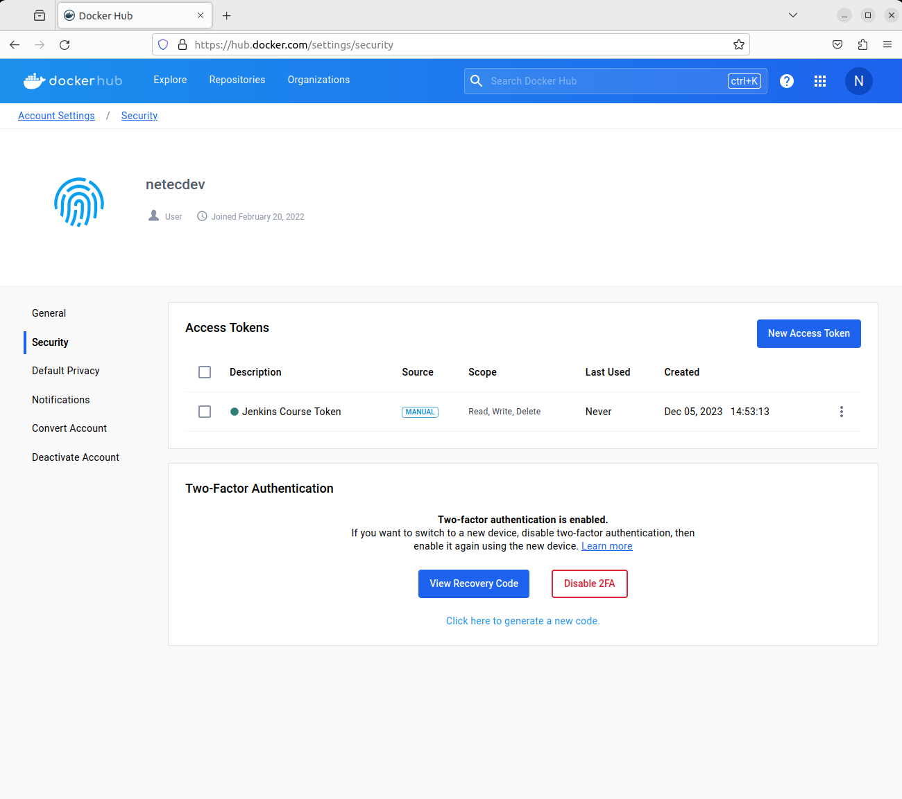
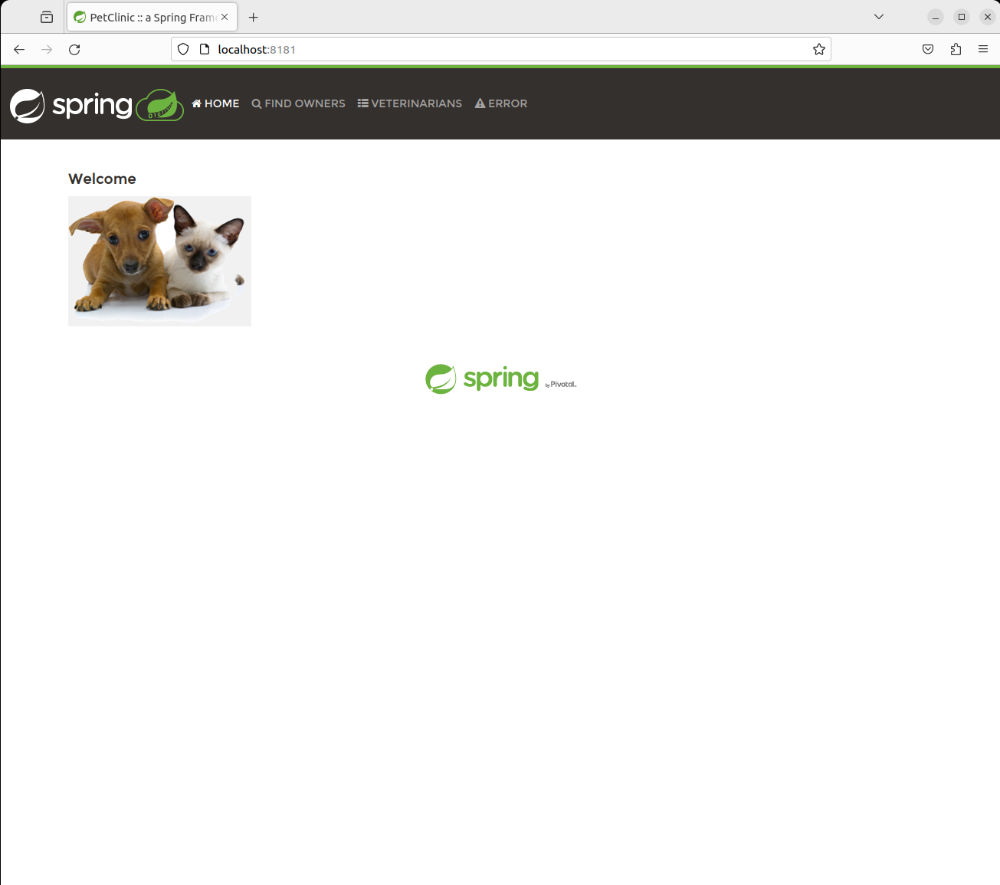

# CONTENEDORIZACIÓN DE UNA APLICACIÓN JAVA

Tiempo aproximado: 20 minutos

## OBJETIVO

*Contenedorizar* una aplicación web en Java.

## PRERREQUISITOS

### DOCKERHUB

Se requiere una cuenta de usuario en:

- <https://hub.docker.com/signup>

<div class="note">

Se recomienda utilizar un coreo personal en la creación de la cuenta.

</div>

#### TOKEN EN DOCKERHUB

Para permitir la comunicación de *Jenkins* a *DockerHub* se recomienda crear un token de acceso en la siguiente dirección <https://hub.docker.com/settings/security> con los siguientes datos:

- Access Token Description: `Jenkins Course Token`
- Access permissions: `Read, Write, Delete`


Guarda el valor del token en un lugar seguro, ya que no existe manera de verlo nuevamente y es el que utilizaremos para el acceso desde *Jenkins*.

En este ejemplo el valor es: `dckr_pat_hfR6qLOR29zR5HwW6X7qRQ0iMzk`


Ahora, en la sección de tokens de acceso se puede apreciar el recién generado:



### RAMA DE TRABAJO

En la carpeta del repositorio de trabajo ubícate en la rama: `labs/mvn-spc`.

``` shell
git switch labs/mvn-spc
```

La salida debe ser similar a:

``` shell
Switched to branch 'labs/mvn-spc'
Your branch is up to date with 'origin/labs/mvn-spc'.
```

Ahora crea la rama en la que se harán las modificaciones de esta actividad:

``` shell
git checkout -b labs/mvn-spc_NOMBREUSUARIO
```

La salida debe ser similar a:

``` shell
Switched to branch 'labs/mvn-spc_NOMBREUSUARIO'
Your branch is up to date with 'origin/labs/mvn-spc_NOMBREUSUARIO'.
```

### ANÁLISIS

Ya en la rama del proyecto Java, analiza el contenido del directorio. Para esto puedes abrir el proyecto en algún IDE de desarrollo como STS, VSCode, etcétera.

### APLICACIÓN NO CONTENEDORIZADA

#### EJECUCIÓN

Después del análisis del proyecto *Java* procedemos a ejecutar el proyecto para conocer su funcionamiento.

``` shell
./mvnw spring-boot:run
```

La parte final de la salida de la ejecución del comando anterior debe ser similar a:

``` shell
              |\      _,,,--,,_
             /,`.-'`'   ._  \-;;,_
  _______ __|,4-  ) )_   .;.(__`'-'__     ___ __    _ ___ _______
 |       | '---''(_/._)-'(_\_)   |   |   |   |  |  | |   |       |
 |    _  |    ___|_     _|       |   |   |   |   |_| |   |       | __ _ _
 |   |_| |   |___  |   | |       |   |   |   |       |   |       | \ \ \ \
 |    ___|    ___| |   | |      _|   |___|   |  _    |   |      _|  \ \ \ \
 |   |   |   |___  |   | |     |_|       |   | | |   |   |     |_
 |___|   |_______| |___| |_______|_______|___|_|  |__|___|_______|  / / / /
 ==================================================================/_/_/_/

:: Built with Spring Boot :: 2.7.3


2023-12-05 12:00:16.821  INFO 15584 --- (restartedMain) o.s.s.petclinic.PetClinicApplication     : Starting PetClinicApplication using Java 17.0.9 on labs with PID 15584 (/home/netec/Desktop/curso/jenkins/target/classes started by netec in /home/netec/Desktop/curso/jenkins)
2023-12-05 12:00:16.826  INFO 15584 --- (restartedMain) o.s.s.petclinic.PetClinicApplication     : No active profile set, falling back to 1 default profile: "default"
2023-12-05 12:00:17.013  INFO 15584 --- (restartedMain) .e.DevToolsPropertyDefaultsPostProcessor : Devtools property defaults active! Set 'spring.devtools.add-properties' to 'false' to disable
2023-12-05 12:00:17.016  INFO 15584 --- (restartedMain) .e.DevToolsPropertyDefaultsPostProcessor : For additional web related logging consider setting the 'logging.level.web' property to 'DEBUG'
2023-12-05 12:00:18.378  INFO 15584 --- (restartedMain) .s.d.r.c.RepositoryConfigurationDelegate : Bootstrapping Spring Data JPA repositories in DEFAULT mode.
2023-12-05 12:00:18.437  INFO 15584 --- (restartedMain) .s.d.r.c.RepositoryConfigurationDelegate : Finished Spring Data repository scanning in 52 ms. Found 2 JPA repository interfaces.
2023-12-05 12:00:19.458  INFO 15584 --- (restartedMain) o.s.b.w.embedded.tomcat.TomcatWebServer  : Tomcat initialized with port(s): 8181 (http)
2023-12-05 12:00:19.467  INFO 15584 --- (restartedMain) o.apache.catalina.core.StandardService   : Starting service(Tomcat)
2023-12-05 12:00:19.468  INFO 15584 --- (restartedMain) org.apache.catalina.core.StandardEngine  : Starting Servlet engine: (Apache Tomcat/9.0.65)
2023-12-05 12:00:19.556  INFO 15584 --- (restartedMain) o.a.c.c.C.(Tomcat).(localhost).(/)       : Initializing Spring embedded WebApplicationContext
2023-12-05 12:00:19.556  INFO 15584 --- (restartedMain) w.s.c.ServletWebServerApplicationContext : Root WebApplicationContext: initialization completed in 2540 ms
2023-12-05 12:00:19.854  INFO 15584 --- (restartedMain) com.zaxxer.hikari.HikariDataSource       : HikariPool-1 - Starting...
2023-12-05 12:00:20.176  INFO 15584 --- (restartedMain) com.zaxxer.hikari.HikariDataSource       : HikariPool-1 - Start completed.
2023-12-05 12:00:20.185  INFO 15584 --- (restartedMain) o.s.b.a.h2.H2ConsoleAutoConfiguration    : H2 console available at '/h2-console'. Database available at 'jdbc:h2:mem:458e01c1-bd24-4232-97f3-6ae74bb1e879'
2023-12-05 12:00:20.628  INFO 15584 --- (restartedMain) org.ehcache.core.EhcacheManager          : Cache 'vets' created in EhcacheManager.
2023-12-05 12:00:20.637  INFO 15584 --- (restartedMain) org.ehcache.jsr107.Eh107CacheManager     : Registering Ehcache MBean javax.cache:type=CacheStatistics,CacheManager=urn.X-ehcache.jsr107-default-config,Cache=vets
2023-12-05 12:00:20.927  INFO 15584 --- (restartedMain) o.hibernate.jpa.internal.util.LogHelper  : HHH000204: Processing PersistenceUnitInfo (name: default)
2023-12-05 12:00:20.966  INFO 15584 --- (restartedMain) org.hibernate.Version                    : HHH000412: Hibernate ORM core version 5.6.10.Final
2023-12-05 12:00:21.143  INFO 15584 --- (restartedMain) o.hibernate.annotations.common.Version   : HCANN000001: Hibernate Commons Annotations (5.1.2.Final)
2023-12-05 12:00:21.321  INFO 15584 --- (restartedMain) org.hibernate.dialect.Dialect            : HHH000400: Using dialect: org.hibernate.dialect.H2Dialect
2023-12-05 12:00:22.202  INFO 15584 --- (restartedMain) o.h.e.t.j.p.i.JtaPlatformInitiator       : HHH000490: Using JtaPlatform implementation: (org.hibernate.engine.transaction.jta.platform.internal.NoJtaPlatform)
2023-12-05 12:00:22.214  INFO 15584 --- (restartedMain) j.LocalContainerEntityManagerFactoryBean : Initialized JPA EntityManagerFactory for persistence unit 'default'
2023-12-05 12:00:23.337  INFO 15584 --- (restartedMain) o.s.b.d.a.OptionalLiveReloadServer       : LiveReload server is running on port 35729
2023-12-05 12:00:23.344  INFO 15584 --- (restartedMain) o.s.b.a.e.web.EndpointLinksResolver      : Exposing 13 endpoint(s) beneath base path '/actuator'
2023-12-05 12:00:23.408  INFO 15584 --- (restartedMain) o.s.b.w.embedded.tomcat.TomcatWebServer  : Tomcat started on port(s): 8181 (http) with context path ''
2023-12-05 12:00:23.433  INFO 15584 --- (restartedMain) o.s.s.petclinic.PetClinicApplication     : Started PetClinicApplication in 7.074 seconds (JVM running for 7.727)
```

#### CONSUMO

En un navegador de internet explora la funcionalidad provista por la aplicación en el url: <http://localhost:8181/>.



#### DETENCIÓN

Para detener la ejecución de la aplicación en la terminal en la que se inició teclea: \[Control + C\].

La terminal de comandos mostrará algo similar a lo siguiente:

``` shell
^C2023-12-05 12:13:18.670  INFO 15584 --- [ionShutdownHook] j.LocalContainerEntityManagerFactoryBean : Closing JPA EntityManagerFactory for persistence unit 'default'
2023-12-05 12:13:18.897  WARN 15584 --- [ionShutdownHook] o.s.b.f.support.DisposableBeanAdapter    : Invocation of destroy method failed on bean with name 'inMemoryDatabaseShutdownExecutor': org.h2.jdbc.JdbcSQLNonTransientConnectionException: Database is already closed (to disable automatic closing at VM shutdown, add ";DB_CLOSE_ON_EXIT=FALSE" to the db URL) [90121-214]
2023-12-05 12:13:18.907  INFO 15584 --- [ionShutdownHook] org.ehcache.core.EhcacheManager          : Cache 'vets' removed from EhcacheManager.
2023-12-05 12:13:18.919  INFO 15584 --- [ionShutdownHook] com.zaxxer.hikari.HikariDataSource       : HikariPool-1 - Shutdown initiated...
2023-12-05 12:13:18.925  INFO 15584 --- [ionShutdownHook] com.zaxxer.hikari.HikariDataSource       : HikariPool-1 - Shutdown completed.
[INFO] ------------------------------------------------------------------------
[INFO] BUILD SUCCESS
[INFO] ------------------------------------------------------------------------
[INFO] Total time:  13:10 min
[INFO] Finished at: 2023-12-05T12:13:19-06:00
[INFO] ------------------------------------------------------------------------
```

### APLICACIÓN CONTENEDORIZADA

#### DOCKERFILE

En la carpeta raíz del proyecto crea el archivo llamado `Dockerfile` con el contenido mostrado a continuación:

``` dockerfile
FROM eclipse-temurin:17-jdk-jammy

WORKDIR /app

COPY .mvn/ .mvn
COPY mvnw pom.xml ./
RUN ./mvnw dependency:resolve

COPY src ./src

CMD ["./mvnw", "spring-boot:run"]
```

##### .DOCKERIGNORE

En la carpeta raíz del proyecto crea el archivo llamado `.dockerignore` con el contenido mostrado a continuación:

``` dockerignore
target
```

#### CONSTRUCCIÓN DE LA IMAGEN

En la carpeta raíz del proyecto crea la imagen *docker* con el comando siguiente:

``` shell
docker build --tag netecdev/java-app .
```

La salida debe ser similar a:

``` shell
[+] Building 220.9s (11/11) FINISHED     docker:default
 => [internal] load build definition from Dockerfile     0.8s
 => => transferring dockerfile: 205B     0.1s
 => [internal] load .dockerignore     0.8s
 => => transferring context: 46B     0.1s
 => [internal] load metadata for docker.io/library/eclipse-temurin:17-jdk-jammy     2.0s
 => [1/6] FROM docker.io/library/eclipse-temurin:17-jdk-jammy@sha256:e34943aa59a441229700368ba22d5806bbff03b0d488c3cc31555373c3b5133f     58.6s
 => => resolve docker.io/library/eclipse-temurin:17-jdk-jammy@sha256:e34943aa59a441229700368ba22d5806bbff03b0d488c3cc31555373c3b5133f     0.2s
 => => sha256:ef3ab7c2888f8f2f9cc043a9f33ce3dac5e7acd0d8fe964188989234337090dc 1.37kB / 1.37kB     0.0s
 => => sha256:807dd649ff14faf72708107297adc1036be3e426cecab1d4bd314328494e5950 6.76kB / 6.76kB     0.0s
 => => sha256:e34943aa59a441229700368ba22d5806bbff03b0d488c3cc31555373c3b5133f 1.21kB / 1.21kB     0.0s
 => => sha256:6cd63fc495d1a4839e5239c716fa5a6ec48209bff26db1e7d7af7b0701ac4ee7 17.46MB / 17.46MB     8.8s
 => => sha256:cbe3537751ce03ea42788c2fbe2d5d336180dc2e20472c8cdba8b3224191d101 30.45MB / 30.45MB     19.5s
 => => sha256:928a7aba20da48e4079db4d39e69d6c1f2935061d810f6ffa2448774c40035bb 144.88MB / 144.88MB    33.9s
 => => sha256:493e5fdcfece74ab3856e443cd2045bd8aaff43cec3d304f03be11a36056db6c 172B / 172B     9.4s
 => => sha256:7dde3ab12c0f85f2f9a988da397a4a64afc2b1e4b5ec4ca72a3e5a620a77d263 734B / 734B     9.6s
 => => extracting sha256:cbe3537751ce03ea42788c2fbe2d5d336180dc2e20472c8cdba8b3224191d101     15.8s
 => => extracting sha256:6cd63fc495d1a4839e5239c716fa5a6ec48209bff26db1e7d7af7b0701ac4ee7     7.8s
 => => extracting sha256:928a7aba20da48e4079db4d39e69d6c1f2935061d810f6ffa2448774c40035bb     12.9s
 => => extracting sha256:493e5fdcfece74ab3856e443cd2045bd8aaff43cec3d304f03be11a36056db6c     0.0s
 => => extracting sha256:7dde3ab12c0f85f2f9a988da397a4a64afc2b1e4b5ec4ca72a3e5a620a77d263     0.0s
 => [internal] load build context     0.9s
 => => transferring context: 1.22MB     0.5s
 => [2/6] WORKDIR /app     2.4s
 => [3/6] COPY .mvn/ .mvn     0.4s
 => [4/6] COPY mvnw pom.xml ./     0.4s
 => [5/6] RUN ./mvnw dependency:resolve     154.3s
 => [6/6] COPY src ./src     0.4s
 => exporting to image     1.2s
 => => exporting layers     1.1s
 => => writing image sha256:7b107915db7c2ef7966204f170d5bb63f3642a5b232ae9c668a9eef969e851c0     0.0s
 => => naming to docker.io/netecdev/java-app
```

Este comando puede tarda unos minutos.

Para validar que la imagen se ha creado y se encuentra en el repositorio local ejecuta:

``` shell
docker image ls
```

La salida debe ser similar a:

``` shell
REPOSITORY          TAG          IMAGE ID       CREATED         SIZE
netecdev/java-app   latest       7b107915db7c   6 minutes ago   511MB
jenkins/jenkins     lts-jdk17    6adc6425cd34   2 weeks ago     476MB
hello-world         latest       9c7a54a9a43c   7 months ago    13.3kB
```

#### CONSTRUCCIÓN DEL CONTENEDOR

En la carpeta raíz del proyecto crea el contenedor *docker* con el comando siguiente:

``` shell
docker run --name java_app --detach --publish 8181:8181 netecdev/java-app
```

La salida debe ser similar a:

``` shell
662aad8fbbbe8b39eac94996b91ab693cd73e2b02dfb4d2deb306fbfa9f2310d
```

Lista los contenedores en ejecución con `docker container ls` y observa que aparece en la lista.

#### CONSUMO

Después de esperar un poco, en un navegador de internet explora la funcionalidad provista por la aplicación en el url: <http://localhost:8181/>.


#### DETENCIÓN

En la carpeta raíz del proyecto detener la aplicación *contenedorizada* con el comando siguiente:

``` shell
docker container stop java_app
```

La salida debe ser similar a:

``` shell
662aad8fbbbe8b39eac94996b91ab693cd73e2b02dfb4d2deb306fbfa9f2310d
```

### PUBLICACIÓN

<div class="note">

En los comandos: el valor `netecdev` debe ser sustituido por tu nombre de usuario. Lo mismo debe hacerse con el valor del token.

</div>

Para publicar la imagen en *DockerHub* debemos estar autenticados para lo cual necesitamos ejecutar:

``` shell
docker login --username netecdev --password dckr_pat_hfR6qLOR29zR5HwW6X7qRQ0iMzk
```

Lo que produce una salida semejante a:

``` shell
WARNING! Using --password via the CLI is insecure. Use --password-stdin.
WARNING! Your password will be stored unencrypted in /home/netec/.docker/config.json.
Configure a credential helper to remove this warning. See
https://docs.docker.com/engine/reference/commandline/login/#credentials-store

Login Succeeded
```

Y con este comando se publica en *DockerHub*:

``` shell
docker push netecdev/java-app:latest
```

Lo que produce una salida semejante a:

``` shell
The push refers to repository [docker.io/netecdev/java-app]
da6c45c2afd8: Pushed
c594d957e4b4: Pushed
6afe6da0c839: Pushed
336f8e4cf74f: Pushed
3816e7c39d80: Pushed
7c44cdc69570: Pushed
50467638fead: Pushed
f6e572ab134b: Pushed
3de9bbd55c1d: Pushed
8ceb9643fb36: Pushed
latest: digest: sha256:15c0ad8f9bc0237cdd8b9c6a34f1f28fe6c156bcf115c06050c8840882f6bd12 size: 2413
```

Para visualizar las imágenes actualmente publicados debes ingresar a: <https://hub.docker.com/repositories/>.


### ACTUALIZACIÓN REPOSITORIO

Para guardar los cambios realizados a la rama de trabajo realiza los siguientes comandos.

``` shell
git add --all
```

La salida indicará los elementos adicionados para la confirmación.

Ahora confirma los archivos con:

``` shell
git commit --message="Contenedorizacion de la aplicacion"
```

Y por último sube los cambios al repositorio remoto con:

``` shell
git push --set-upstream origin labs/mvn-spc_NOMBREUSUARIO
```

La salida debe ser similar a:

``` shell
Enumerating objects: 6, done.
Counting objects: 100% (6/6), done.
Delta compression using up to 4 threads
Compressing objects: 100% (4/4), done.
Writing objects: 100% (4/4), 1.32 KiB | 1.32 MiB/s, done.
Total 4 (delta 0), reused 0 (delta 0), pack-reused 0
remote:
remote: Create a pull request for 'labs/jenkinsfile-hola' on GitHub by visiting:
remote:      https://github.com/netec-dev/jenkins/pull/new/labs/mvn-spc_NOMBREUSUARIO
remote:
To github.com:netec-dev/jenkins_cabrera-pedro.git
 * [new branch]      labs/mvn-spc_NOMBREUSUARIO -> labs/mvn-spc_NOMBREUSUARIO
Branch 'labs/mvn-spc_NOMBREUSUARIO' set up to track remote branch 'labs/mvn-spc_NOMBREUSUARIO' from 'origin'.
```

## RESULTADO

Comenta los puntos más relevantes de esta tarea.

---

[CAPÍTULO 06](../C06.md)
