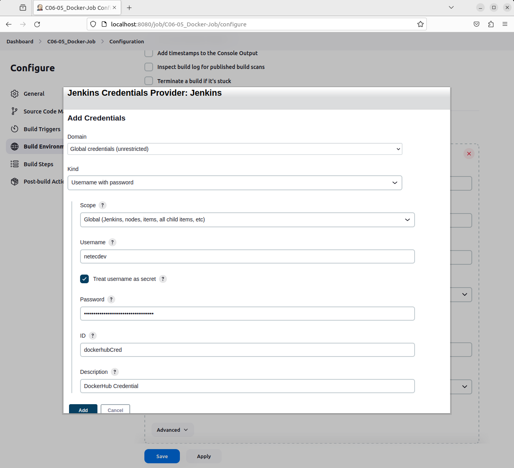
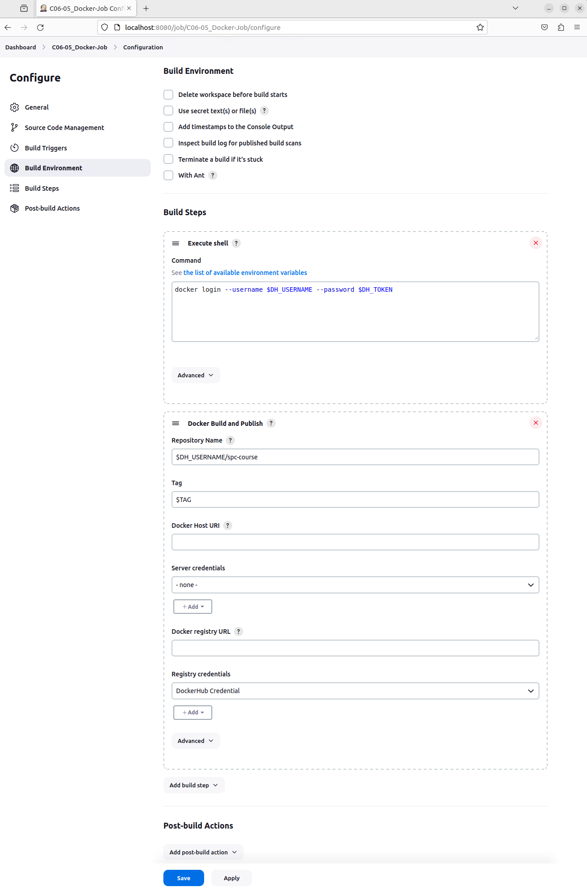
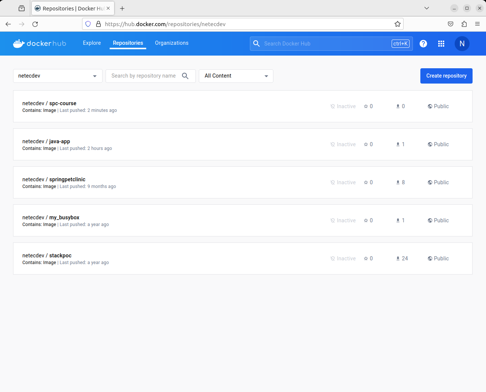

# JENKINS: INTEGRACIÓN CON DOCKER

Tiempo aproximado: 15 minutos

## OBJETIVO

Crear un proyecto estilo libre para la gestión simple del ciclo de vida de un proyecto *Maven* que incluye la publicación de la imagen en *DockerHub*.

## PRERREQUISITOS

### DOCKERHUB

Se requiere la cuenta de usuario y el token de acceso creado en la actividad anterior.

### CONFIGURACIÓN

Para que podamos lanzar comandos *Docker* desde *Jenkins* se requiere adicionar el grupo `docker` al usuario `jenkins`.

``` shell
sudo usermod -aG docker jenkins
```

Es necesario reiniciar para que la configuración se cargué adecuadamente.

## DESARROLLO

### JENKINS: PLUGIN DOCKER

En un navegador web ingresa el enlace <http://localhost:8080/manage/pluginManager/available> para configurar el *plugin* de *Docker* en *Jenkins*.

En el campo de búsqueda ingrese: `Cloudbees Docker Build and Publish`


Marca la opción de `Install` y da clic en el botón `Download now and install after restart`.

Marca la opción `Restart Jenkins when installation is complete and no jobs are running` y espera hasta que se termine la instalación.

- Después de haber esperado unos 3-5 minutos y no ver cambios recarga la pantalla.

### CREACIÓN

En la pantalla principal (<http://localhost:8080/>) de Jenkins crea un nuevo proyecto dando clic en [+ New Item](http://localhost:8080/view/all/newJob) con los siguientes datos:

- Nombre: `C06-05_Docker-Job`
- Tipo de proyecto: `Freestyle project`

Después de ingresar la información da clic en `OK`.

### CONFIGURACIÓN

A continuación, se indica la información a añadir en cada sección.

#### GENERAL

En la sección de `Configuration/General` ingresa la siguiente información:

- Descripción: `Prueba de concepto de proyecto para la gestión simple del ciclo de vida de un proyecto Maven que incluye la publicación de la aplicación en DockerHub.`

- This project is parameterized: [SELECCIONADO]

##### PARÁMETRO CADENA (STRING)

Ingrese la información siguiente para un nuevo parámetro.

- Name: `TAG`
- Default Value: `1.0.0`
- Description: `Valor para la tag de la imagen Docker.`
- Trim the string: [SELECCIONADO]

##### PARÁMETRO CADENA (STRING)

Ingrese la información siguiente para un nuevo parámetro.

- Name: `DH_USERNAME`
- Default Value: `netecdev`
  - Sustituir por tu usuario.
- Description: `Nombre de usuario en DockerHub.`
- Trim the string: [SELECCIONADO]

##### PARÁMETRO CONTRASEÑA (PASSWORD)

Ingrese la información siguiente para un nuevo parámetro.

- Name: `DH_TOKEN`
- Default Value: `dckr_pat_hfR6qLOR29zR5HwW6X7qRQ0iMzk`
  - Sustituir por tu token.
- Description: `Token de acceso a DockerHub.`

#### SOURCE CODE MANAGEMENT

- Git
  - Repositories
    - Repository URL: `https://github.com/cabrera-pedro/jenkins_cabrera-pedro.git`
      - Recuerda que debe ser la URL a tu repositorio. La indicada es de ejemplo y la tuya debe ser similar ésta.
    - Credentials: `GitHub Course Credentials`
  - Branches to build:
    - Branch Specifier (blank for 'any'): `labs/mvn-spc_sol`
      - Sustituir por tu rama de trabajo.

#### BUILD STEPS

En la opción `Configuration/Build Steps/Add build step/Execute shell` ingresa la siguiente información:

- Execute shell

``` shell
docker login --username $DH_USERNAME --password $DH_TOKEN
```

En la opción `Configuration/Build Steps/Add build step/Docker Build and Publish` ingresa la siguiente información:

- Docker Build and Publish
  - Repository Name: `$DH_USERNAME/spc-course`
  - Tag: `$TAG`
  - Registry Credentials
    - Add / Jenkins
      - Kind: `Username with Password`
        - Username: `netecdev`
          - Sustituir por tu usuario en DockerHub.
        - Treat username as secret: [SELECCIONADO]
        - Password: `dckr_pat_hfR6qLOR29zR5HwW6X7qRQ0iMzk`
          - Sustituir por tu token.
        - ID: `dockerhubCred`
        - Description: `DockerHub Credential`





#### SAVE

Da clic en el botón de guardado ( `Save` )

### CONSTRUCCIÓN

Para comprobar el envío de las notificaciones ejecuta el *job* dando clic en la opción `Build with Parameter` del menú lateral.

Para ejecutar de manera exitosa el *job* valida que la opciones para los parámetros de entrada son:

- TAG: `1.0.0`
- DH_USERNAME: `netecdev`
  - El valor debe ser tu usuario en DockerHub.
- DH_TOKEN: `dckr_pat_hfR6qLOR29zR5HwW6X7qRQ0iMzk`
  - El valor no está visible, y debe coincidir con tu token en DockerHub.

A continuación, da clic en el botón `Build` y verifica que la construcción ha sido exitosa.

Adicionalmente comprueba los cambios en la interfaz del *job* y del *build*.

#### SALIDA EN CONSOLA

En la parte inferior de la barra lateral izquierda, en la sección `Build History` se puede apreciar el historial de ejecución (*build*) del *job*.

Al dar clic en alguno de los enlaces (en cada renglón) se puede observar la información general del *build*.

Para observar la salida en consola de la construcción se debe seleccionar la opción `Console Output` del menú lateral.

La salida debe ser semejante a:

``` shell
Lanzada por el usuario Netec JenkinsUser
Running as SYSTEM
Ejecutando.en el espacio de trabajo /var/lib/jenkins/workspace/C06-05_Docker-Job
The recommended git tool is: NONE
using credential githubCourseCredential
 > git rev-parse --resolve-git-dir /var/lib/jenkins/workspace/C06-05_Docker-Job/.git # timeout=10
Fetching changes from the remote Git repository
 > git config remote.origin.url https://github.com/cabrera-pedro/jenkins_cabrera-pedro.git # timeout=10
Fetching upstream changes from https://github.com/cabrera-pedro/jenkins_cabrera-pedro.git
 > git --version # timeout=10
 > git --version # 'git version 2.34.1'
using GIT_ASKPASS to set credentials GitHub Course Credentials
 > git fetch --tags --force --progress -- https://github.com/cabrera-pedro/jenkins_cabrera-pedro.git +refs/heads/*:refs/remotes/origin/* # timeout=10
 > git rev-parse refs/remotes/origin/labs/mvn-spc_sol^{commit} # timeout=10
 > git rev-parse labs/mvn-spc_sol^{commit} # timeout=10
Checking out Revision f7accd5536198e5f2e07e01f55b0196f772a61bd (refs/remotes/origin/labs/mvn-spc_sol)
 > git config core.sparsecheckout # timeout=10
 > git checkout -f f7accd5536198e5f2e07e01f55b0196f772a61bd # timeout=10
Commit message: "A possible solution"
First time build. Skipping changelog.
[C06-05_Docker-Job] $ /bin/sh -xe /tmp/jenkins17198354360463051539.sh
+ docker login --username netecdev --password dckr_pat_hfR6qLOR29zR5HwW6X7qRQ0iMzk
WARNING! Using --password via the CLI is insecure. Use --password-stdin.
WARNING! Your password will be stored unencrypted in /var/lib/jenkins/.docker/config.json.
Configure a credential helper to remove this warning. See
https://docs.docker.com/engine/reference/commandline/login/#credentials-store

Login Succeeded
[C06-05_Docker-Job] $ docker build -t netecdev/spc-course:1.0.0 --pull=true /var/lib/jenkins/workspace/C06-05_Docker-Job
#0 building with "default" instance using docker driver

#1 [internal] load build definition from Dockerfile
#1 transferring dockerfile: 205B 0.0s done
#1 DONE 0.1s

#2 [internal] load .dockerignore
#2 transferring context: 46B done
#2 DONE 0.1s

#3 [internal] load metadata for docker.io/library/eclipse-temurin:17-jdk-jammy
#3 ...

#4 [auth] library/eclipse-temurin:pull token for registry-1.docker.io
#4 DONE 0.0s

#3 [internal] load metadata for docker.io/library/eclipse-temurin:17-jdk-jammy
#3 DONE 0.7s

#5 [1/6] FROM docker.io/library/eclipse-temurin:17-jdk-jammy@sha256:e34943aa59a441229700368ba22d5806bbff03b0d488c3cc31555373c3b5133f
#5 DONE 0.0s

#6 [internal] load build context
#6 transferring context: 9.42kB 0.0s done
#6 DONE 0.1s

#7 [2/6] WORKDIR /app
#7 CACHED

#8 [3/6] COPY .mvn/ .mvn
#8 CACHED

#9 [4/6] COPY mvnw pom.xml ./
#9 CACHED

#10 [5/6] RUN ./mvnw dependency:resolve
#10 CACHED

#11 [6/6] COPY src ./src
#11 CACHED

#12 exporting to image
#12 exporting layers done
#12 writing image sha256:12321531d133d4465b67a660af96f24fe555b73e320a144f85d389c0e3a7cfde
#12 writing image sha256:12321531d133d4465b67a660af96f24fe555b73e320a144f85d389c0e3a7cfde 0.0s done
#12 naming to docker.io/netecdev/spc-course:1.0.0 0.0s done
#12 DONE 0.0s
[C06-05_Docker-Job] $ docker build -t netecdev/spc-course:latest --pull=true /var/lib/jenkins/workspace/C06-05_Docker-Job
#0 building with "default" instance using docker driver

#1 [internal] load build definition from Dockerfile
#1 transferring dockerfile: 205B done
#1 DONE 0.1s

#2 [internal] load .dockerignore
#2 transferring context: 46B done
#2 DONE 0.1s

#3 [internal] load metadata for docker.io/library/eclipse-temurin:17-jdk-jammy
#3 DONE 0.2s

#4 [1/6] FROM docker.io/library/eclipse-temurin:17-jdk-jammy@sha256:e34943aa59a441229700368ba22d5806bbff03b0d488c3cc31555373c3b5133f
#4 DONE 0.0s

#5 [internal] load build context
#5 transferring context: 9.42kB 0.0s done
#5 DONE 0.1s

#6 [4/6] COPY mvnw pom.xml ./
#6 CACHED

#7 [5/6] RUN ./mvnw dependency:resolve
#7 CACHED

#8 [2/6] WORKDIR /app
#8 CACHED

#9 [3/6] COPY .mvn/ .mvn
#9 CACHED

#10 [6/6] COPY src ./src
#10 CACHED

#11 exporting to image
#11 exporting layers done
#11 writing image sha256:12321531d133d4465b67a660af96f24fe555b73e320a144f85d389c0e3a7cfde 0.0s done
#11 naming to docker.io/netecdev/spc-course:latest 0.0s done
#11 DONE 0.0s
[C06-05_Docker-Job] $ docker push netecdev/spc-course:1.0.0
The push refers to repository [docker.io/netecdev/spc-course]
c2fd90c68bd3: Preparing
7849f861b84d: Preparing
7961c4ba0202: Preparing
134789d8f9a8: Preparing
3816e7c39d80: Preparing
7c44cdc69570: Preparing
50467638fead: Preparing
f6e572ab134b: Preparing
3de9bbd55c1d: Preparing
8ceb9643fb36: Preparing
f6e572ab134b: Waiting
3de9bbd55c1d: Waiting
8ceb9643fb36: Waiting
7c44cdc69570: Waiting
50467638fead: Waiting
3816e7c39d80: Layer already exists
7961c4ba0202: Layer already exists
7849f861b84d: Layer already exists
c2fd90c68bd3: Layer already exists
134789d8f9a8: Layer already exists
f6e572ab134b: Layer already exists
3de9bbd55c1d: Layer already exists
7c44cdc69570: Layer already exists
8ceb9643fb36: Layer already exists
50467638fead: Layer already exists
1.0.0: digest: sha256:02768655eb8f4988d0e59a115f49aebe505d6cd2f629e10d641f9aa74a5f2781 size: 2412
[C06-05_Docker-Job] $ docker push netecdev/spc-course:latest
The push refers to repository [docker.io/netecdev/spc-course]
c2fd90c68bd3: Preparing
7849f861b84d: Preparing
7961c4ba0202: Preparing
134789d8f9a8: Preparing
3816e7c39d80: Preparing
7c44cdc69570: Preparing
50467638fead: Preparing
f6e572ab134b: Preparing
3de9bbd55c1d: Preparing
8ceb9643fb36: Preparing
7c44cdc69570: Waiting
50467638fead: Waiting
f6e572ab134b: Waiting
3de9bbd55c1d: Waiting
8ceb9643fb36: Waiting
7961c4ba0202: Layer already exists
134789d8f9a8: Layer already exists
3816e7c39d80: Layer already exists
7849f861b84d: Layer already exists
c2fd90c68bd3: Layer already exists
3de9bbd55c1d: Layer already exists
f6e572ab134b: Layer already exists
50467638fead: Layer already exists
7c44cdc69570: Layer already exists
8ceb9643fb36: Layer already exists
latest: digest: sha256:02768655eb8f4988d0e59a115f49aebe505d6cd2f629e10d641f9aa74a5f2781 size: 2412
Finished: SUCCESS
```

#### DOCKERHUB

Visita <https://hub.docker.com/repositories/> para validar que la imagen a sido publicada.




### RESULTADO

Comenta los puntos más relevantes de esta tarea.

---

[CAPÍTULO 06](../C06.md)
