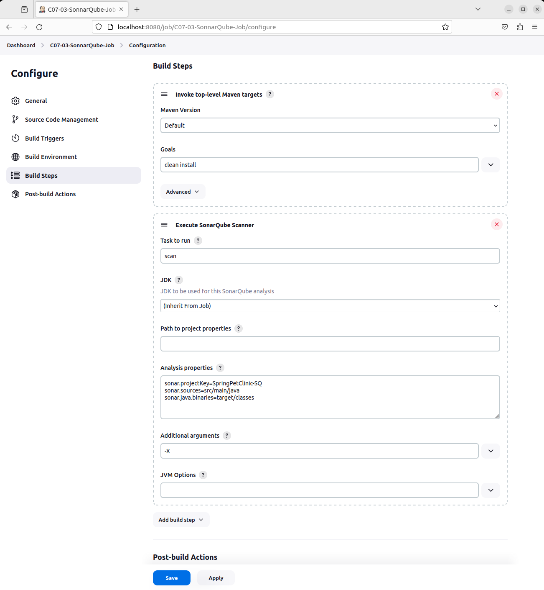
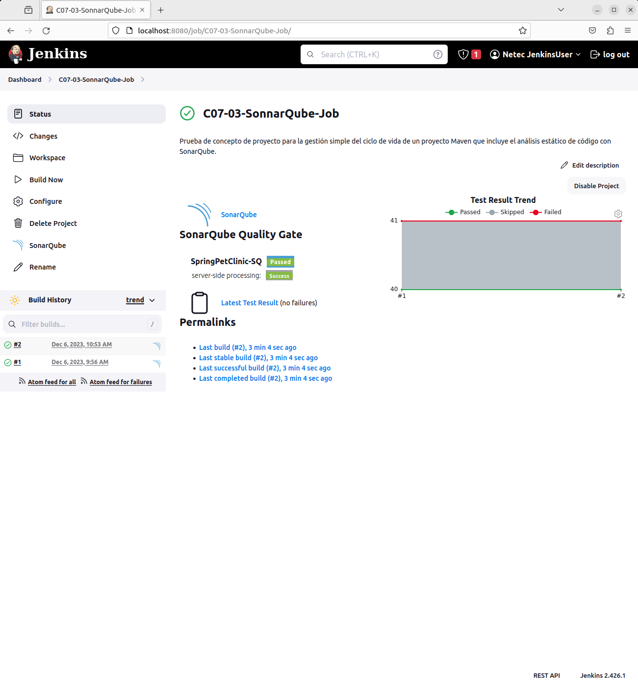
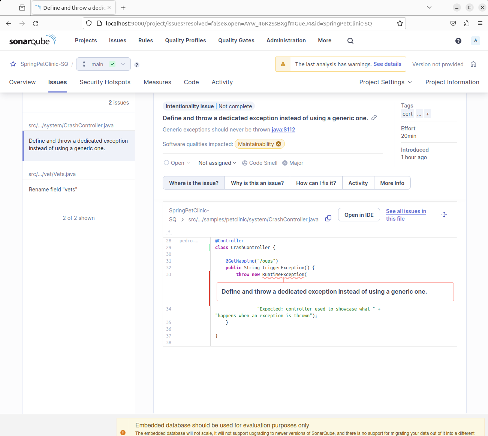

# JENKINS: INTEGRACIÓN CON SONARQUBE

Tiempo aproximado: 20 minutos

## OBJETIVO

Crear un proyecto estilo libre para la gestión simple del ciclo de vida de un proyecto *Maven* que incluye el análisis estático de código con *SonarQube*.

## PRERREQUISITOS

### SONARQUBE

Se requiere que la actividad anterior esté concluida satisfactoriamente.

### GRUPO JENKINS

Para que podamos lanzar comandos *Docker* desde *Jenkins* se requiere adicionar el grupo `docker` al usuario `jenkins`.

``` shell
sudo usermod -aG docker jenkins
```

Es necesario reiniciar para que la configuración se cargué adecuadamente.

## DESARROLLO

### CREACIÓN

En la pantalla principal (<http://localhost:8080/>) de Jenkins crea un nuevo proyecto dando clic en [+ New Item](http://localhost:8080/view/all/newJob) con los siguientes datos:

- Nombre: `C07-03-SonarQube-Job`
- Tipo de proyecto: `Freestyle project`

Después de ingresar la información da clic en `OK`.

### CONFIGURACIÓN

A continuación, se indica la información a añadir en cada sección.

#### GENERAL

En la sección de `Configuration/General` ingresa la siguiente información:

- Descripción: `Prueba de concepto de proyecto para la gestión simple del ciclo de vida de un proyecto Maven que incluye el análisis estático de código con SonarQube.`

#### SOURCE CODE MANAGEMENT

- Git
  - Repositories
    - Repository URL: `https://github.com/cabrera-pedro/jenkins_cabrera-pedro.git`
      - Recuerda que debe ser la URL a tu repositorio. La indicada es de ejemplo y la tuya debe ser similar ésta.
    - Credentials: `GitHub Course Credentials`
  - Branches to build:
    - Branch Specifier (blank for 'any'): `labs/sonarqube-spc`
      - Sustituir por tu rama de trabajo.

#### BUILD STEPS

En la opción `Configuration/Build Steps/Add build step/Invoke top-level Maven targets` ingresa la siguiente información:

- Invoke top-level Maven targets
  - Maven Version: `Default`
  - Goals: `clean install`

En la opción `Configuration/Build Steps/Add build step/Execute SonarQube Scanner` ingresa la siguiente información:

- Execute SonarQube Scanner
  - Task to run: `scan`
    - Esta opción puede no aparecer.
  - Analysis properties:

``` shell
sonar.projectKey=SpringPetClinic-SQ
sonar.sources=src/main/java
sonar.java.binaries=target/classes
```



#### POST-BUILD ACTIONS

En la sección de acciones posteriores a la construcción adicionar la acción `Publish JUnit test result report` con la siguiente información:

- Add post-build action / Publish JUnit test result report
  - Test report XMLs: `*/target/surefire-reports/.xml`

#### SAVE

Da clic en el botón de guardado ( `Save` )

### CONSTRUCCIÓN

Para comprobar el envío de las notificaciones ejecuta el *job* dando clic en la opción `Build Now` del menú lateral.

Adicionalmente comprueba los cambios en la interfaz del *job* y del *build*.

#### SALIDA EN CONSOLA

En la parte inferior de la barra lateral izquierda, en la sección `Build History` se puede apreciar el historial de ejecución (*build*) del *job*.

Al dar clic en alguno de los enlaces (en cada renglón) se puede observar la información general del *build*.

Para observar la salida en consola de la construcción se debe seleccionar la opción `Console Output` del menú lateral.

De dique un momento a analizar la salida, para localizar las secciones donde se interactúa con *SonarQube*.

#### SONARQUBE

Para analizar el resultado del análisis del código se puede visitar directamente la página de *SonarQube* <http://localhost:9000> y seleccionar el proyecto generado. Incluso desde la página del estado del *job* en *Jeknins* hay un enlace directo con el texto *SonarQube* (<http://localhost:9000/dashboard?id=SpringPetClinic-SQ>).



A continuación, se muestran algunas pantallas del reporte. Se recomineda dedicar algunos minutos al análisis del reporte generado.




## RESULTADO

Comenta los puntos más relevantes de esta sección.

---

[CAPÍTULO 07](../C07.md)
