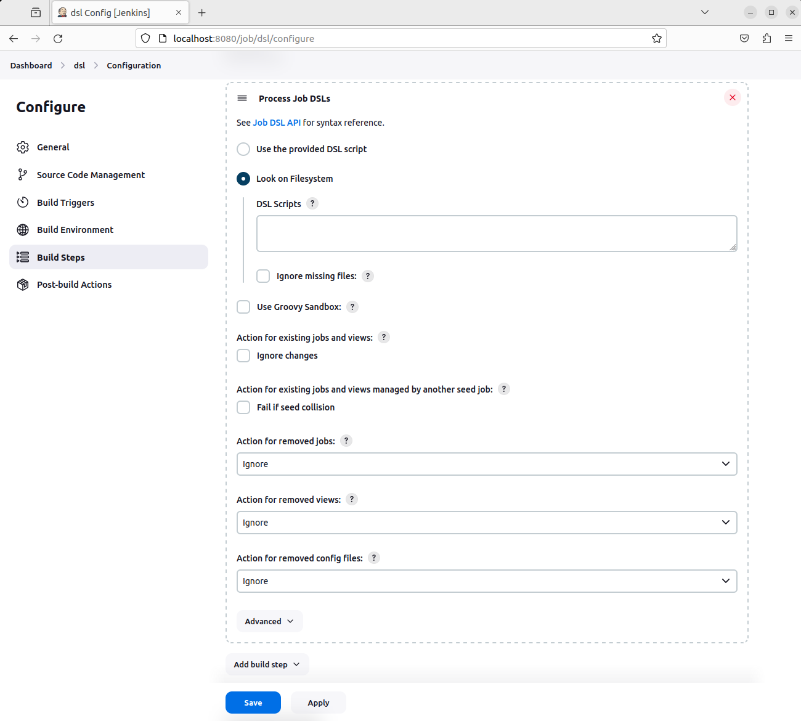

# JOB DSL: INSTALACIÓN

Tiempo aproximado: 10 minutos

## OBJETIVO

Instalar y configurar el complemento *Job DSL*.

## DESARROLLO

### INSTALACIÓN

En un navegador web ingresa el enlace <http://localhost:8080/manage/pluginManager/available> para configurar el complemento en *Jenkins*.

En el campo de búsqueda ingresa `Job DSL`, de la lista selecciona el componente localizado. Marca la opción de `Install` y da clic en el botón `Install`.

Marca la opción `Restart Jenkins when installation is complete and no jobs are running` y espera a que el proceso termine la instalación y reinicie _Jenkins_.

Ahora en los proyectos estilo libre tendremos la posibilidad de adicionar el paso de construcción `Process Job DSLs`.

### CONFIGURACIÓN

En la configuración de seguridad general de *Jenkins* (<http://localhost:8080/manage/configureSecurity/>), localiza la sección `CSRF Protection` y deshabilita `Enable script security for Job DSL scripts`.

Da clic en `Apply` y `Save`.

## RESULTADO

Comenta los puntos más relevantes de esta sección.

---

[CAPÍTULO 08](../C08.md)
