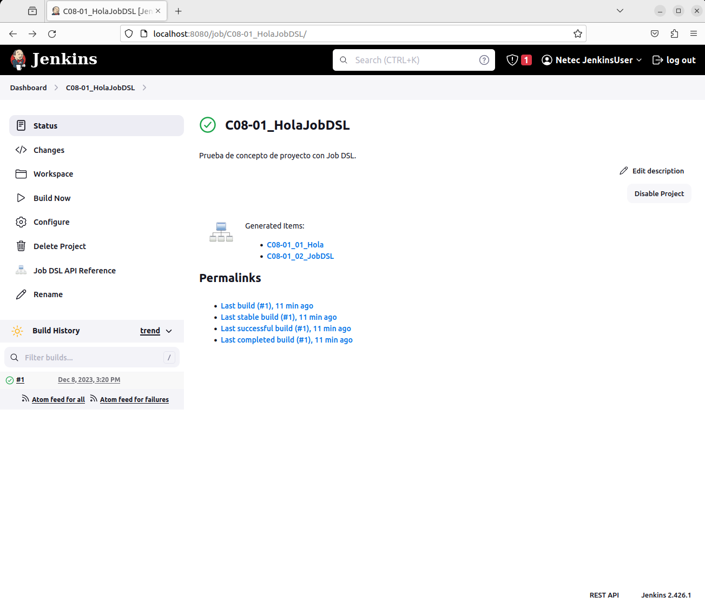

# JENKINS: HOLA JOB DSL

Tiempo aproximado: 15 minutos

## OBJETIVO

Crear un proyecto estilo libre semilla con Job DSL que crea dos *jobs* con pasos de ejecución de comandos.

## PRERREQUISITOS

Se requiere instalado y configurado el complemento `Job DSL`.

## DESARROLLO

### CREACIÓN

En la pantalla principal (<http://localhost:8080/>) de Jenkins crea un nuevo proyecto dando clic en [+ New Item](http://localhost:8080/view/all/newJob) con los siguientes datos:

- Nombre: `C08-01_HolaJobDSL`
- Tipo de proyecto: `Freestyle project`

Después de ingresar la información da clic en `OK`.

### CONFIGURACIÓN

A continuación, se indica la información a añadir en cada sección.

#### GENERAL

En la sección de `Configuration/General` ingresa la siguiente información:

- Descripción: `Prueba de concepto de proyecto con Job DSL.`

#### BUILD STEPS

En la opción `Configuration/Build Steps/Add build step/Process Job DSLs` ingresa la siguiente información:

- Process Job DSLs
  - Use the provided DSL script: [SELECCIONADO]
    - DSL Script:

``` groovy
job('C08-01_01_Hola') {
  steps {
    shell('echo Hola')
  }
}
job('C08-01_02_JobDSL') {
  steps {
    shell('echo Job DSL')
  }
}
```


#### SAVE

Da clic en el botón de guardado ( `Save` )

### CONSTRUCCIÓN

Para comprobar el envío de las notificaciones ejecuta el *job* dando clic en la opción `Build Now` del menú lateral.

Adicionalmente comprueba los cambios en la interfaz del *job* y del *build*.

#### SALIDA EN CONSOLA

En la parte inferior de la barra lateral izquierda, en la sección `Build History` se puede apreciar el historial de ejecución (*build*) del *job*.

Al dar clic en alguno de los enlaces (en cada renglón) se puede observar la información general del *build*.

Para observar la salida en consola de la construcción se debe seleccionar la opción `Console Output` del menú lateral.

LA salida debe ser semejante a:

``` shell
Lanzada por el usuario Netec JenkinsUser
Running as SYSTEM
Ejecutando.en el espacio de trabajo /var/lib/jenkins/workspace/C08-01_HolaJobDSL
Processing provided DSL script
Added items:
    GeneratedJob{name='C08-01_01_Hola'}
    GeneratedJob{name='C08-01_02_JobDSL'}
Finished: SUCCESS
```

### PROYECTOS GENERADOS

Visita la página de *status* del *job* recién creado (<http://localhost:8080/job/C08-01_HolaJobDSL/>) y analiza los dos elementos creados dando clic la sección que aparece con el texto `Generated items:`.



Dentro de cada *job* generado, analiza su configuración, su construcción y su salida.

## RESULTADO

Comenta los puntos más relevantes de esta sección.

---

[CAPÍTULO 08](../C08.md)
