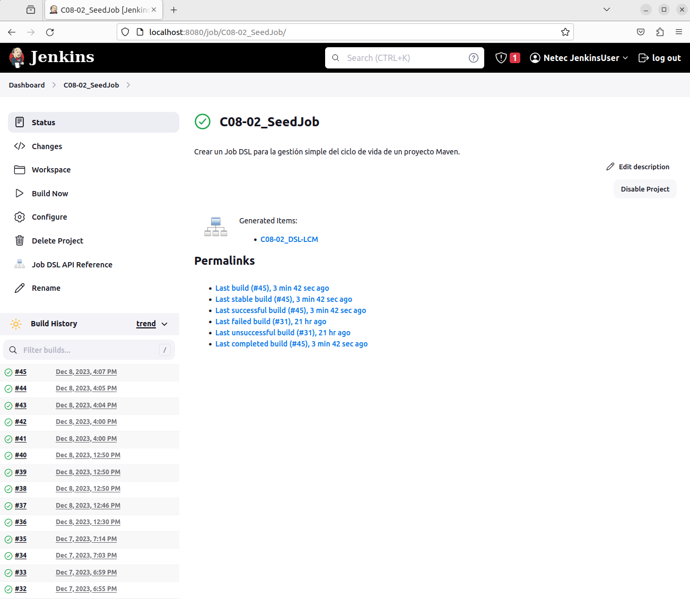

# JENKINS: JOB DSL

Tiempo aproximado: 15 minutos

## OBJETIVO

Crear un Job DSL para la gestión simple del ciclo de vida de un proyecto Maven.

## PRERREQUISITOS

- Se requiere tener instalado y configurado el complemento `Job DSL`.
- Se requiere tener instalado y configurado el complemento `Slack Notifier`.

## DESARROLLO

### CREACIÓN

En la pantalla principal (<http://localhost:8080/>) de Jenkins crea un nuevo proyecto dando clic en [+ New Item](http://localhost:8080/view/all/newJob) con los siguientes datos:

- Nombre: `C08-02_SeedJob`
- Tipo de proyecto: `Freestyle project`

Después de ingresar la información da clic en `OK`.

### CONFIGURACIÓN

A continuación, se indica la información a añadir en cada sección.

#### GENERAL

En la sección de `Configuration/General` ingresa la siguiente información:

- Descripción: `Prueba de concepto de proyecto con Job DSL.`

#### BUILD STEPS

En la opción `Configuration/Build Steps/Add build step/Process Job DSLs` ingresa la siguiente información:

- Process Job DSLs
  - Use the provided DSL script: [SELECCIONADO]
    - DSL Script:

``` groovy
job('C08-02_DSL-LCM') {
  description('Crear un Job DSL para la gestión simple del ciclo de vida de un proyecto Maven.')
  parameters {
    stringParam("APP_JAR_NAME", "hello-world-0.1.0-SNAPSHOT.jar", "Nombre del archivo jar con la aplicación a ejecutar.")
    choiceParam('NAME', ['Mundo', 'ERROR'], 'Valor de entrada a la lógica de negocio. El valor ERROR propicia un error en la ejecución.')
  }
  scm {
    git{
      remote{
        url("https://github.com/netec-dev/jenkins.git")
        credentials("githubCourseCredential")
        branch("labs/mvn-standalone")
      }
    }
  }
  triggers {
    //cron('H/2 * * * *') // Ejecutar cada 2 minutos
  }
  steps {
    maven {
      goals('clean compile')
      mavenInstallation('Default')
    }
    maven {
      goals('install')
      mavenInstallation('Default')
    }
    shell('echo $WORKSPACE')
    shell('java -jar $WORKSPACE/target/$APP_JAR_NAME $NAME')
  }
  publishers {
    archiveJunit('**/target/surefire-reports/*.xml')
    slackNotifier {
      teamDomain('netecgroup')
      room('#jenkins')
      commitInfoChoice('AUTHORS_AND_TITLES')
      startNotification(true)
      //
      notifySuccess(true)
      notifyAborted(true)
      notifyNotBuilt(true)
      notifyUnstable(true)
      notifyRegression(true)
      notifyEveryFailure(true)
      notifyBackToNormal(true)
        //
      includeTestSummary(true)
      includeFailedTests(true)
    }
  }
}
```

Analiza cada segmento del DSL mostrado.
Modifica la dirección del repositorio Git para _apuntar_ al tuyo, por ejemplo: `https://github.com/cabrera-pedro/jenkins_cabrera-pedro2.git`

#### SAVE

Da clic en el botón de guardado ( `Save` )

### CONSTRUCCIÓN

Para comprobar el envío de las notificaciones ejecuta el *job* dando clic en la opción `Build Now` del menú lateral.

Adicionalmente comprueba los cambios en la interfaz del *job* y del *build*.

#### SALIDA EN CONSOLA

En la parte inferior de la barra lateral izquierda, en la sección `Build History` se puede apreciar el historial de ejecución (*build*) del *job*.

Al dar clic en alguno de los enlaces (en cada renglón) se puede observar la información general del *build*.

Para observar la salida en consola de la construcción se debe seleccionar la opción `Console Output` del menú lateral.

La salida debe ser semejante a:

``` shell
Lanzada por el usuario Netec JenkinsUser
Running as SYSTEM
Ejecutando.en el espacio de trabajo /var/lib/jenkins/workspace/C08-02_SeedJob
Processing provided DSL script
Existing items:
    GeneratedJob{name='C08-02_DSL-LCM'}
Finished: SUCCESS
```

### PROYECTO GENERADO

Visita la página de *status* del *job* recién creado ([http://localhost:8080/job/C08-02_SeedJob/](http://localhost:8080/job/C08-02_SeedJob//)) y analiza el elemento creado dando clic la sección que aparece con el texto `Generated items:`.



Dentro del *job* generado, analiza su configuración (mapea cada sección del DSL a la configuración en la interfaz de usuario), su construcción y su salida (en la consola y en Slack).

## RESULTADO

Comenta los puntos más relevantes de esta sección.

---

[CAPÍTULO 08](../C08.md)
