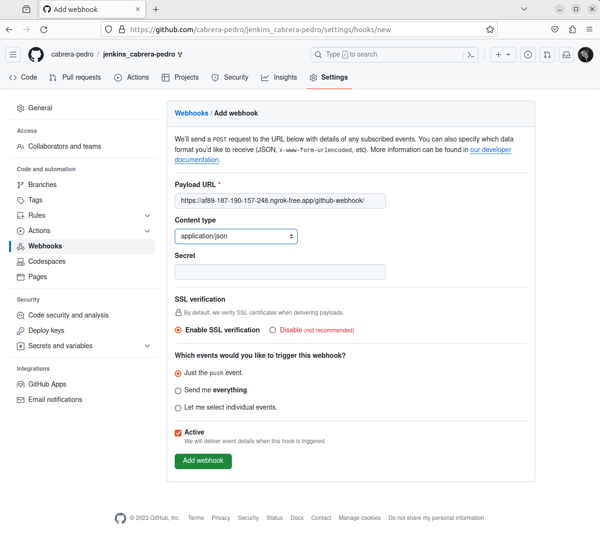
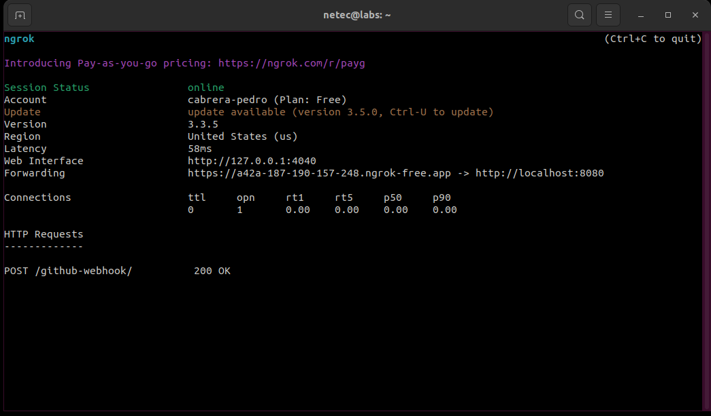

# WEBHOOK EN GITHUB

Tiempo aproximado: 15 minutos

## OBJETIVO

Instalar la herramienta _ngrok_ para recibir notificaciones desde _GitHub_ a _Jenkins_. Configurar un _webhook_ en _GitHub_.

## DESARROLLO

### NGROK

#### INSTALACIÓN

Para instalar ejecuta el comando:

``` shell
sudo snap install ngrok
```

Con una salida semejante a:

``` shell
ngrok (v3/stable) 3.3.5 from Kyle Wenholz (kyle-ngrok) installed
```

#### TOKEN

Para obtener el token de utilización se requiere crear una cuenta en <https://dashboard.ngrok.com/signup>. Se recomienda autenticarse con _GitHub_ (Sign up with GitHub).

Es posible que requiera una autenticación multi factor, por lo que será necesario alguna herramienta como _Google Authenticator_, _Microsoft Authenticator_, _1Password_, etcétera.


Una vez autenticado, se procede a activar _ngrok_ ejecutando en una terminal el comando de autorización de _ngrok_.

En la página <https://dashboard.ngrok.com/get-started/setup/linux> se pueden encontrar los detalles.


Para el sistema operativo _Linux_ ejecuta:

``` shell
ngrok config add-authtoken 2MFgfoUVvolgZMg5aDn1YINlYfe_fYZMPADe2gHCfacpC6J9
```

**Recuerda que debes sustituir el token por el que te ha proporcionado tu registro.**

El comando tiene una salida similar a:

``` shell
Authtoken saved to configuration file: /home/netec/snap/ngrok/118/.config/ngrok/ngrok.yml
```

#### EJECUCIÓN

En una terminal de comandos, que se quedará activa hasta que se ejecuta `Control + C`; procede a iniciar _ngrok_ con el comando:

``` shell
ngrok http 8080
```

Con una salida similar a:

``` shell
ngrok                                                                                                                 (Ctrl+C to quit)


Want to improve ngrok? Take our survey:  https://ngrok.com/survey

Session Status                online
Account                       cabrera-pedro (Plan: Free)
Update                        update available (version 3.1.1, Ctrl-U to update)
Version                       3.1.0
Region                        United States (us)
Latency                       55ms
Web Interface                 http://127.0.0.1:4040
Forwarding                    https://56de-187-188-11-60.ngrok.app -> http://localhost:8080

Connections                   ttl     opn     rt1     rt5     p50     p90
                              0       0       0.00    0.00    0.00    0.00
```

En la parte inferior, en la sección `Connections` irán apareciendo las notificaciones enviadas por _GitHub_.

### GITHUB

En la página web de _GitHub_, localiza el repositorio de trabajo (el que fue bifurcado anteriormente y debe tener un nombre similar a `jenkins_cabrera-pedro`); selecciona la opción `Settings` y `Webhooks`.

En esa pantalla da clic en el botón `Add webhook` y provee la siguiente información:

- `Webhooks` / `Add webhook`

  - `Payload URL`: `https://a42a-187-190-157-248.ngrok-free.app/github-webhook/`

    - La dirección proporcionada por la herramienta _ngrok_ más el sufijo `github-webhook/`.

  - `Content type`: application/json



Para guardar las modificaciones, da clic en `Add webhook`.

Verifica en la ventana de _ngrok_ que el _webhook_ se ha comunicado correctamente.



Recuerda que la ventana de ejecución de _ngrok_ no debe ser cerrada, ni bloqueada para el correcto funcionamiento de la actividad.

## RESULTADO

Comenta los puntos más relevantes de esta sección.

---

[CAPÍTULO 10](../C10.md)
