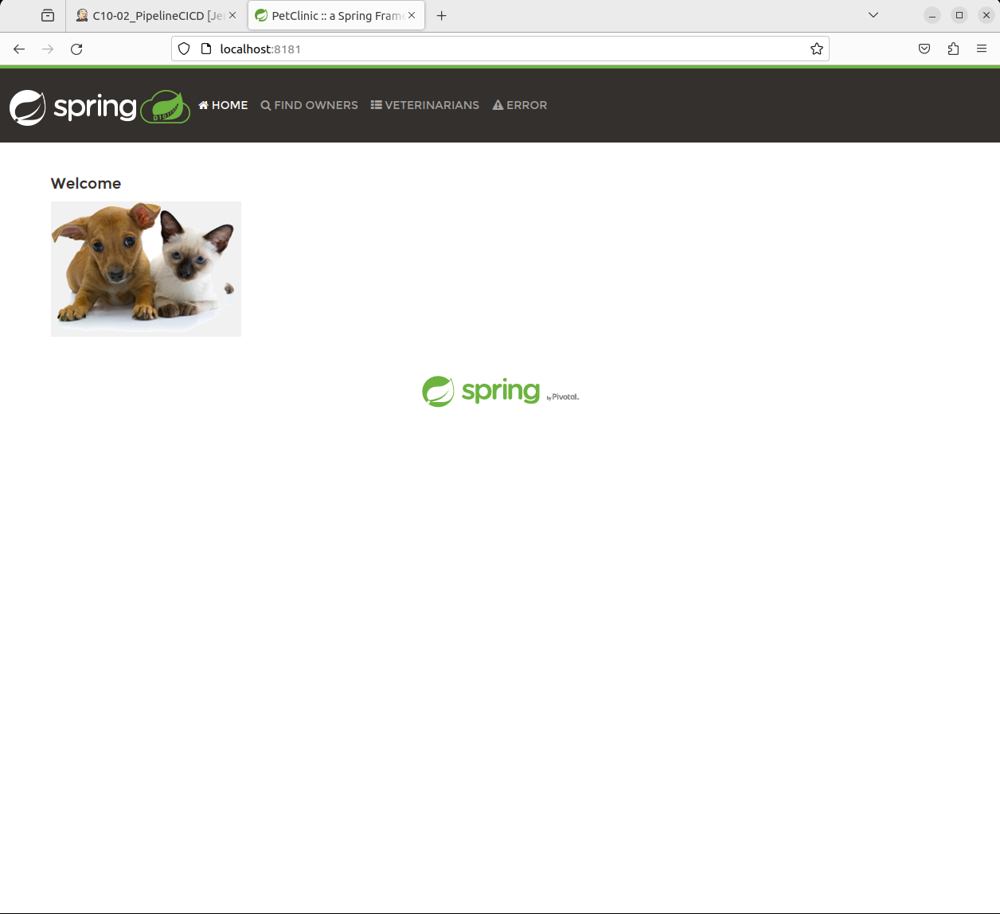
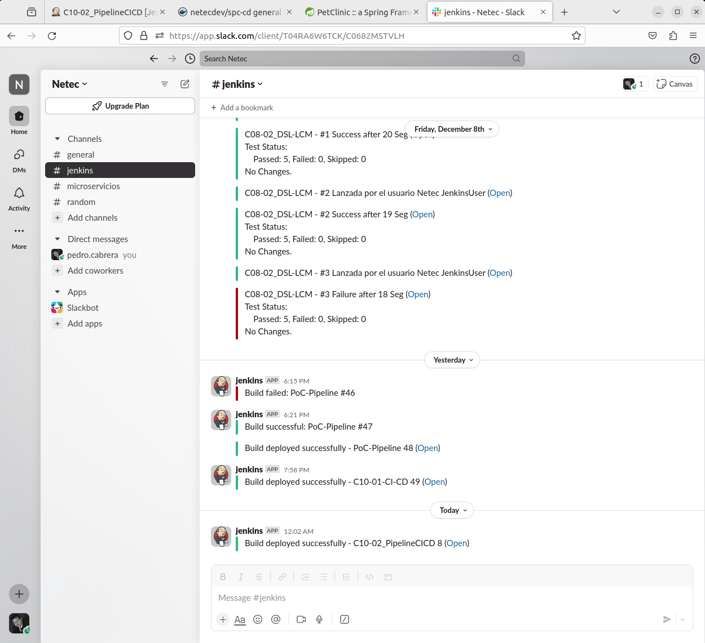

# PIPELINE CI/CD - STAGES

Tiempo aproximado: 40 minutos

## OBJETIVO

Adicionar etapas al proyecto _pipeline_ creado previamente para definir un flujo de CI/CD.

## PRERREQUISITOS

Se requiere que el contenedor con _SonarQube_ este activo. Para iniciarlo ejecuta:

``` shell
docker container start sonarqube
```

## DESARROLLO

### RAMA DE TRABAJO

En la carpeta del repositorio de trabajo ubícate en la rama: `labs/jenkins-cicd_NOMBREUSUARIO`.

``` shell
git switch labs/jenkins-cicd_NOMBREUSUARIO
```

La salida debe ser similar a:

``` shell
Switched to branch 'labs/jenkins-cicd_NOMBREUSUARIO'
Your branch is up to date with 'origin/labs/jenkins-cicd_NOMBREUSUARIO'.
```

Ve realizando las siguientes modificaciones.

### ENVIRONMENT, TOOLS Y PARAMETERS

Haz que el archivo `Jenkinsfile` existente contenga lo siguiente:

``` jenkinsfile
pipeline {
    agent any
    environment {
        DOCKERHUB_CREDENTIALS = credentials('dockerhubCred')
    }
    tools {
        maven 'Default'
    }
    parameters {
        string defaultValue: 'spc-cd', description: 'Nombre de la aplicación.', name: 'APP_NAME', trim: true
        string defaultValue: '0.1.0', description: 'Tag de la imagen Docker.', name: 'IMAGE_TAG', trim: true
        string defaultValue: 'spc-cd', description: 'Nombre del contenedor de la aplicación construida.', name: 'CONTAINER_NAME', trim: true
    }
    triggers {
        githubPush()
    }
    stages {
        stage('Build') {
            steps {
                echo 'Stage para la construcción'
            }
        }
    }
}
```

#### PUSH

Para guardar y subir los cambios realice los siguientes comandos:

``` shell
git add --all
git commit --message="Inclusión de environment, tools y parameters"
git push --set-upstream origin labs/jenkins-cicd_cabrera-pedro
```

Recuerde estos tres comandos, ya que cada cambio que se realice al `Jenkinsfile` deberá ser confirmado y subido para observar como se van adicionando etapas a la tubería.

#### CONSTRUCCIÓN

Nota que al subir los cambios al repositorio remoto se ejecuta la tubería automáticamente ya que está configurado en la sección de `triggers` que los eventos `push` la inicien.

Dedica unos minutos a observar la configuración, la salida en consola y el grafo.

### ETAPA: CONSTRUCCIÓN DE LA APLICACIÓN

Adiciona la etapa siguiente:

``` jenkinsfile
        stage('Build') {
            steps {
                //sh 'mvn clean package'
                withSonarQubeEnv('SonarQube') {
                    sh 'mvn clean package sonar:sonar'
                }
                echo 'Maven Build App Completed.'
            }
        }
```

#### PUSH

Para guardar y subir los cambios realice los siguientes comandos:

``` shell
git add --all
git commit --message="Etapa Build"
git push --set-upstream origin labs/jenkins-cicd_cabrera-pedro
```

Recuerde estos tres comandos, ya que cada cambio que se realice al `Jenkinsfile` deberá ser confirmado y subido para observar como se van adicionando etapas a la tubería.

#### CONSTRUCCIÓN

Nota que al subir los cambios al repositorio remoto se ejecuta la tubería automáticamente ya que está configurado en la sección de `triggers` que los eventos `push` la inicien.

Dedica unos minutos a observar la configuración, la salida en consola y el grafo.

#### ETAPA: PRUEBAS

Adiciona la etapa siguiente:

``` jenkinsfile
        stage('Test') {
            steps {
                    sh 'mvn test'
                    echo 'Unit Tests Executed'
            }
            post {
                always {
                    junit 'target/surefire-reports/*.xml'
                    echo 'Unit Tests Report Published.'
                }
            }
        }
```

#### PUSH

Para guardar y subir los cambios realice los siguientes comandos:

``` shell
git add --all
git commit --message="Etapa Test"
git push --set-upstream origin labs/jenkins-cicd_cabrera-pedro
```

Recuerde estos tres comandos, ya que cada cambio que se realice al `Jenkinsfile` deberá ser confirmado y subido para observar como se van adicionando etapas a la tubería.

#### CONSTRUCCIÓN

Nota que al subir los cambios al repositorio remoto se ejecuta la tubería automáticamente ya que está configurado en la sección de `triggers` que los eventos `push` la inicien.

Dedica unos minutos a observar la configuración, la salida en consola, el grafo y el reporte en _SonarQube_ (<http://localhost:9000/dashboard?id=org.springframework.samples%3Aspring-petclinic>).


### ETAPA: DOCKERIZACIÓN

Adiciona la etapa siguiente:

``` jenkinsfile
        stage('DockerHub Login') {
            steps {
                sh "echo $DOCKERHUB_CREDENTIALS_PSW | docker login -u $DOCKERHUB_CREDENTIALS_USR --password-stdin"
                echo 'Login Completed.'
            }
        }
        stage('Build Docker Images') {
            parallel {
                stage('Current Tag') {
                    steps{
                        sh "docker build --tag $DOCKERHUB_CREDENTIALS_USR/${params.APP_NAME}:${params.IMAGE_TAG} ."
                        echo 'Build Image Completed.'
                    }
                }
                stage('Latest Tag') {
                    steps{
                        sh "docker build --tag $DOCKERHUB_CREDENTIALS_USR/${params.APP_NAME}:latest ."
                        echo 'Build Image:latest Completed.'
                    }
                }
            }
        }
        stage ('Push Image To DockerHub') {
            parallel {
                stage('Current Tag') {
                    steps{
                        sh "docker push $DOCKERHUB_CREDENTIALS_USR/${params.APP_NAME}:${params.IMAGE_TAG}"
                        echo "Image $DOCKERHUB_CREDENTIALS_USR/${params.APP_NAME}:${params.IMAGE_TAG} pushed."
                    }
                }
                stage('Latest Tag') {
                    steps{
                        sh "docker push $DOCKERHUB_CREDENTIALS_USR/${params.APP_NAME}:latest"
                        echo "Image $DOCKERHUB_CREDENTIALS_USR/${params.APP_NAME}:latest pushed."
                    }
                }
            }
        }
```

#### PUSH

Para guardar y subir los cambios realice los siguientes comandos:

``` shell
git add --all
git commit --message="Etapa Dokerizacion"
git push --set-upstream origin labs/jenkins-cicd_cabrera-pedro
```

Recuerde estos tres comandos, ya que cada cambio que se realice al `Jenkinsfile` deberá ser confirmado y subido para observar como se van adicionando etapas a la tubería.

#### CONSTRUCCIÓN

Nota que al subir los cambios al repositorio remoto se ejecuta la tubería automáticamente ya que está configurado en la sección de `triggers` que los eventos `push` la inicien.

Dedica unos minutos a observar la configuración, la salida en consola, el grafo y en los repositorios de imágenes docker locales (`docker image ls`) y remotos (<https://hub.docker.com/>).


### ETAPA: EJECUCIÓN DE LA APLICACIÓN

Adiciona la etapa siguiente:

``` jenkinsfile
        stage ('Running App') {
            steps {
                sh "docker container rm --force ${params.CONTAINER_NAME}  2> /dev/null || echo 'El contenedor no existe'"
                sh "docker run --name ${params.CONTAINER_NAME} --detach --rm --publish 8181:8181 $DOCKERHUB_CREDENTIALS_USR/${params.APP_NAME}:${params.IMAGE_TAG}"
                echo "App Running In ${params.CONTAINER_NAME} Container."
            }
        }
```

#### PUSH

Para guardar y subir los cambios realice los siguientes comandos:

``` shell
git add --all
git commit --message="Etapa ejecución de la aplicación"
git push --set-upstream origin labs/jenkins-cicd_cabrera-pedro
```

Recuerde estos tres comandos, ya que cada cambio que se realice al `Jenkinsfile` deberá ser confirmado y subido para observar como se van adicionando etapas a la tubería.

#### CONSTRUCCIÓN

Nota que al subir los cambios al repositorio remoto se ejecuta la tubería automáticamente ya que está configurado en la sección de `triggers` que los eventos `push` la inicien.

Dedica unos minutos a observar la configuración, la salida en consola, el grafo y en la aplicación recién desplegada en el contenedor.

- Contenedores: `docker container ls`

- Aplicación Web: <http://localhost:8181>.



### POST: NOTIFICACIONES Y CIERRES

Adiciona la siguiente sección `post` a nivel de `stages`:

``` jenkinsfile
    post {
        always {
            sh 'docker logout'
            echo 'Docker Logged Out.'
        }
        success {
            slackSend channel: '#jenkins', color: 'good', message: "Build deployed successfully - ${env.JOB_NAME} ${env.BUILD_NUMBER} (<${env.BUILD_URL}|Open>)"
        }
        failure {
            //slackSend failOnError:true, message:"Build failed  - ${env.JOB_NAME} ${env.BUILD_NUMBER} (<${env.BUILD_URL}|Open>)"
            slackSend(
                channel: '#jenkins',
                color: 'danger',
                message: "Build failed  - ${env.JOB_NAME} ${env.BUILD_NUMBER} (<${env.BUILD_URL}|Open>)"
            )
        }
    }
```

#### PUSH

Para guardar y subir los cambios realice los siguientes comandos:

``` shell
git add --all
git commit --message="Etapa notificaciones y cierres"
git push --set-upstream origin labs/jenkins-cicd_cabrera-pedro
```

Recuerde estos tres comandos, ya que cada cambio que se realice al `Jenkinsfile` deberá ser confirmado y subido para observar como se van adicionando etapas a la tubería.

#### CONSTRUCCIÓN

Nota que al subir los cambios al repositorio remoto se ejecuta la tubería automáticamente ya que está configurado en la sección de `triggers` que los eventos `push` la inicien.

Dedica unos minutos a observar la configuración, la salida en consola, el grafo y las notificaciones en <http://slack.com>.



### GRAFO FINAL

Al finalizar los ajustes en el archivo `Jenkinsfile` el grafo resultante debe ser semejante a el mostrado en la siguiente imagen:


## RESULTADO

Comenta los puntos más relevantes de esta sección.

---

[CAPÍTULO 10](../C10.md)
