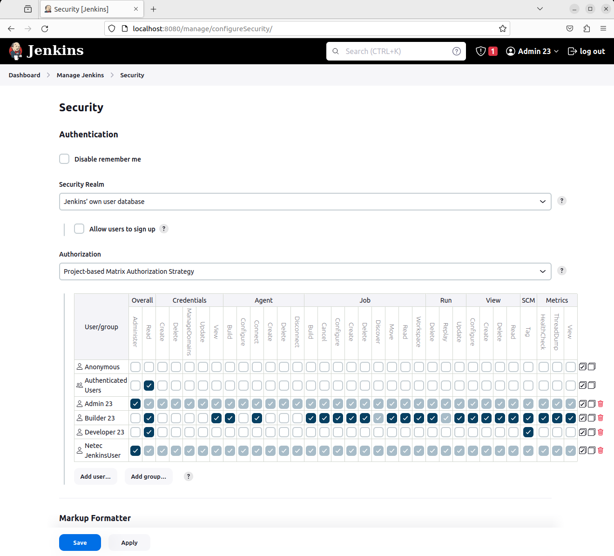
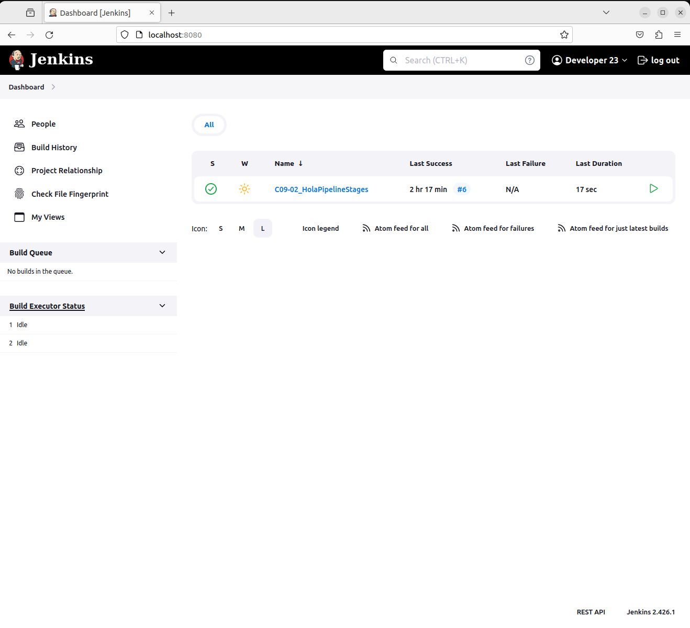

# SEGURIDAD BASADA EN PROYECTO

Tiempo aproximado: 10 minutos

## OBJETIVO

Configurar la estrategia de seguridad basada en proyecto.

## DESARROLLO

### CREAR USUARIOS

En la pantalla de usuarios (<http://localhost:8080/manage/securityRealm/>) crea los siguientes usuarios:

- Create User
  - Username: `Admin`
  - Password: `Admin24`
  - Confirm Password: `Admin24`
  - Full name: `Admin 24`
  - E-mail address: `admin24@netec.com`
- Create User
  - Username: `Builder`
  - Password: `Builder24`
  - Confirm Password: `Builder24`
  - Full name: `Builder 24`
  - E-mail address: `builder24@netec.com`
- Create User
  - Username: `Developer`
  - Password: `Developer24`
  - Confirm Password: `Developer24`
  - Full name: `Developer 24`
  - E-mail address: `developer24@netec.com`

### ESTRATEGIA DE AUTORIZACIÓN

En la pantalla de gestión de seguridad (<http://localhost:8080/manage/configureSecurity/>) selecciona en `Authorization` la opción: `Project-based Matrix Authorization Strategy`.

A continuación, configura los permisos para que quede como se muestra en la imagen siguiente:

Aplica y guarda los cambios realizados.

### PROJECTO A USUARIO

Selecciona alguno de los proyectos existentes y asigna solo a un usuario todos los permisos.

### VALIDACIÓN

Ahora ingresa con cada una de los usuarios creados y observa los cambios en las posibilidades de cada uno debido a los permisos asignados.

Por ejemplo, el usuario `Developer` solo tiene acceso completo a un proyecto.

## RESULTADO

Comenta los puntos más relevantes de esta sección.

---

[CAPÍTULO 11](../C11.md)
